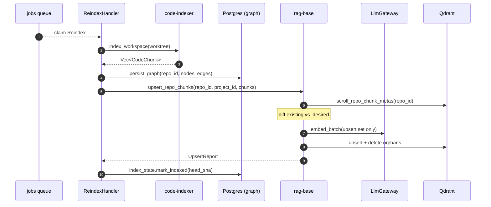
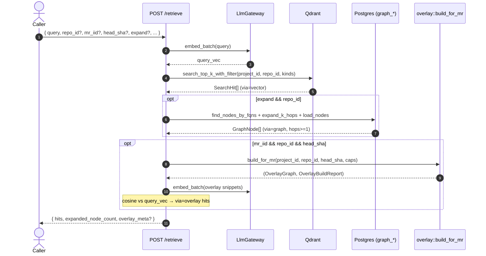
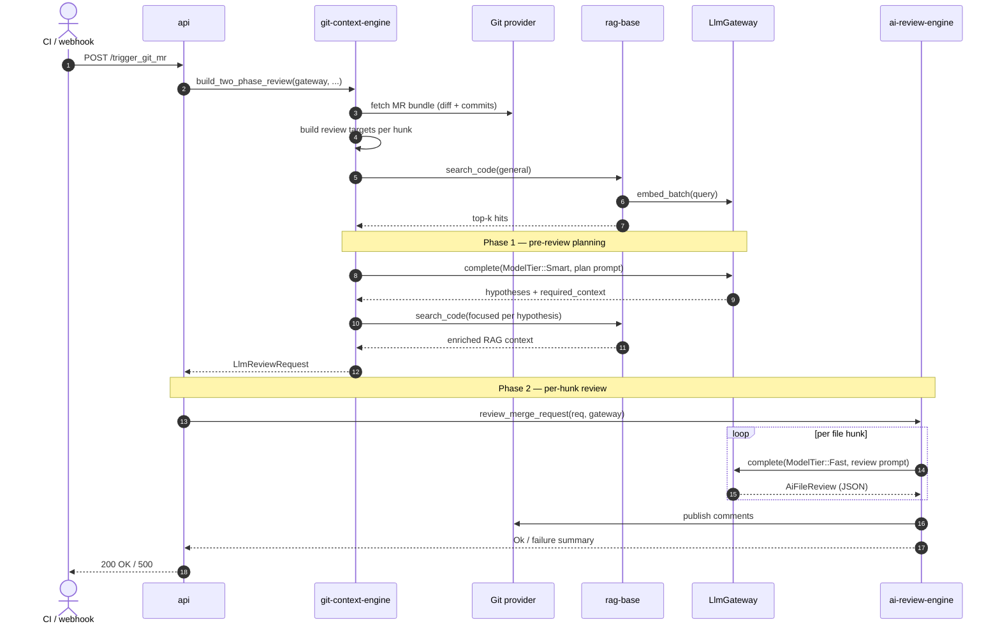
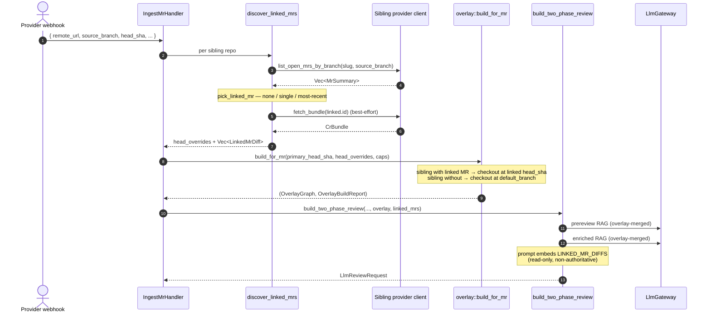

# Data Flow

End-to-end sequences for the two main interactive flows. Both diagrams use
the same actor names as the [Architecture Overview](overview.md).

## Flow 1 — Master push reindex (S2)

The production master flow: a push webhook lands on `IngestPush`, the
handler refreshes the bare clone and enqueues `Reindex`. `ReindexHandler`
analyses the worktree, persists the code graph to Postgres, and then
runs `rag_base::upsert_repo_chunks` to keep Qdrant in sync via content-sha
dedup — only changed chunks reach `LlmGateway::embed_batch`.



See [Ingestion Pipeline](../services/ingestion-pipeline.md) for the full
contract and failure modes.

## Flow 1c — Retrieve (S8)

`POST /retrieve` is the canonical read path. Mechanical pipeline — no
LLM rerank — that surfaces vector hits, graph-expanded neighbours, and
(when an MR is being reviewed) overlay-merged chunks.



See [Retrieve API](../reference/retrieve-api.md) for the request /
response contract and status codes.

## Flow 2 — Review an MR

Triggered by `POST /trigger_git_mr` with `{project_id, mr_iid, secret}`.
Two-phase: pre-review **planning** (smart tier) then per-hunk **review**
(fast tier).



**Key call sites:**

- HTTP entry: [`api/src/routes/check_mr/trigger_mr_route.rs`](../../api/src/routes/check_mr/trigger_mr_route.rs)
- Two-phase orchestration: [`git-context-engine/src/lib.rs:116`](../../git-context-engine/src/lib.rs#L116)
- Pre-review planning prompt: [`git-context-engine/src/pre_review/mod.rs`](../../git-context-engine/src/pre_review/mod.rs)
- Per-hunk review: [`ai-review-engine/src/lib.rs:87`](../../ai-review-engine/src/lib.rs#L87)
- Comment publishing: [`ai-review-engine/src/publish/`](../../ai-review-engine/src/publish/)

## Flow 2b — Cross-repo MR review (M4)

When a project federates N repositories (`[[project.repo]]` entries in
`projects.toml`), the worker enriches the canonical Flow 2 with sibling
context. The MR's `source_branch` drives discovery; the overlay walker
+ prompt builder consume the results.



**Case fan-out:**

- Sibling repo has no open MR on the branch → no `head_overrides`
  entry, no `LinkedMrDiff`, sibling pulled at `default_branch`
  (cases 1 + 2).
- Sibling has exactly one → pinned head SHA + diff embedded (case 3).
- Sibling has multiple → most-recently-updated wins, others ignored,
  `warn!(target="cross_repo.ambiguous")` flags the operator-side
  branch-hygiene problem.

**Failure modes (all best-effort):**

| Failure | Fallback |
|---|---|
| Sibling token missing | Skip sibling, no override / no linked diff. |
| `list_open_mrs_by_branch` HTTP error | Skip sibling. |
| `fetch_bundle` fails after a pick | Keep head_override (overlay still pinned), prompt gets metadata-only footer. |
| Entire overlay build fails | Review still runs against primary repo only (M2 behaviour). |

See [services/multi-repo-review](../services/multi-repo-review.md) for
the full plan.

## Cross-cutting concerns

### Distributed trace context (sprint 2)

When `OTEL_EXPORTER_OTLP_ENDPOINT` is set, every `info_span!` and
`#[tracing::instrument]`-decorated function emits an OTel span. The
span tree threads through the webhook → worker boundary via a W3C
`traceparent` written into the job payload:

```
webhook.gitlab  ──[ inject_into_payload ]──▶  jobs(payload.traceparent)
                                                       │
                                                       ▼
                       worker.process_one ──[ set_parent_from_payload ]──▶ job-span
                                                       │
                                                       ▼
                       reindex.handle_inner → analyze_workspace → persist_graph → upsert_chunks
                                                                                       │
                                                                                       ▼
                                                                       qdrant.search_top_k_with_filter
                                                                       llm.embed_batch / llm.complete
```

The propagation helpers live in
[`observability::tracing::propagation`](../../observability/src/tracing/propagation.rs)
and degrade to no-ops when OTLP is disabled.

### Per-request analytics

Every `gateway.complete(...)` and `gateway.embed_batch(...)` call emits a
single `info!` log line with:

```
request_id=<uuid> tier=Fast provider=openai model=gpt-4o-mini
prompt_tokens=128 completion_tokens=512 total_tokens=640 cost_usd=0.000326
latency_ms=842
```

This is the canonical signal for cost dashboards and SLO alerts. See
[guides/observability](../guides/observability.md).

### Failure propagation

- Provider HTTP errors → `ProviderError::HttpStatus` with status + URL +
  256-char body snippet.
- Provider transport errors → `GatewayError::HttpTransport`.
- Misconfiguration → `GatewayError::Config` at startup, never at runtime.
- Errors cross crate boundaries via `From<GatewayError>` impls in
  `ai-review-engine` and `git-context-engine`.

Reference: [reference/errors](../reference/errors.md).
