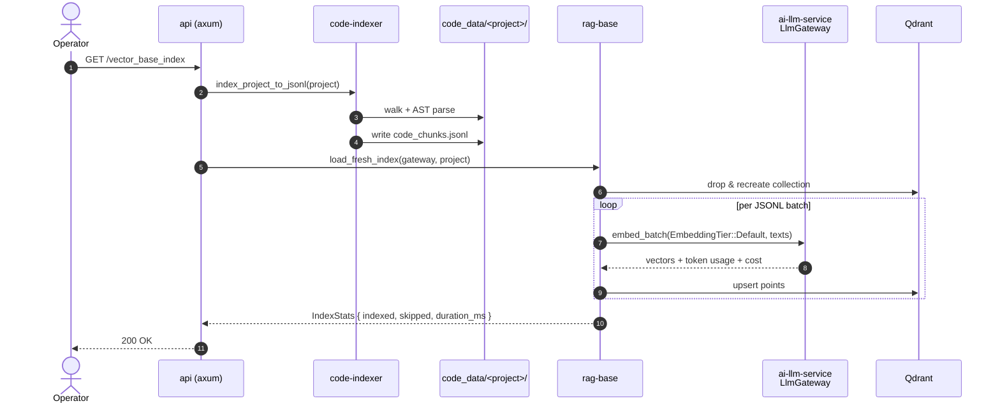
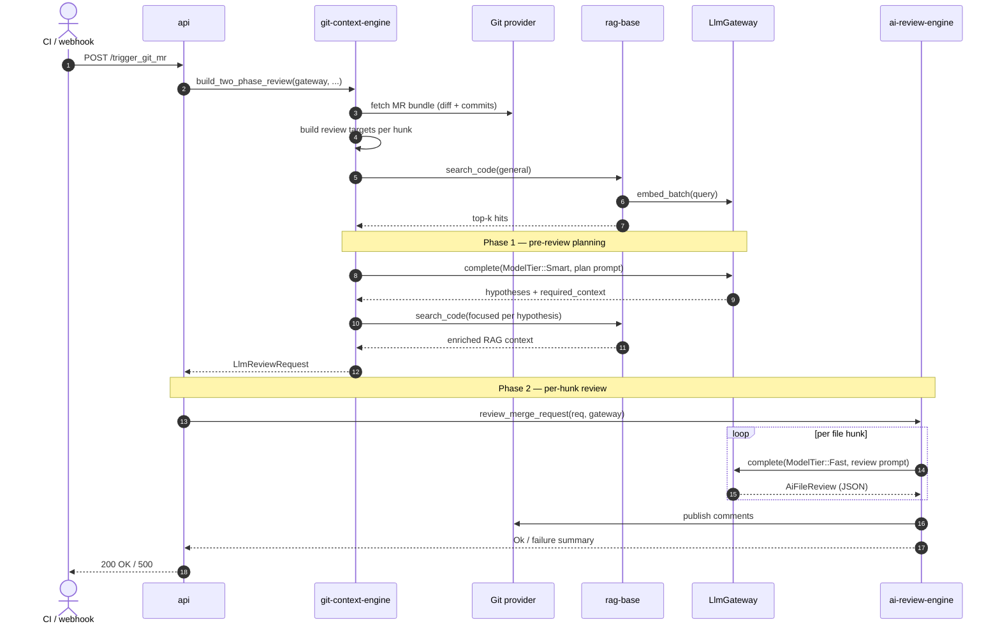

# Data Flow

End-to-end sequences for the two main interactive flows. Both diagrams use
the same actor names as the [Architecture Overview](overview.md).

## Flow 1 — Index a project

Triggered by `GET /vector_base_index`. Builds (or rebuilds) the Qdrant
collection for the configured `PROJECT_NAME`.



**Key call sites:**

- HTTP entry: [`api/src/routes/rag_base/vector_base_index_route.rs`](../../api/src/routes/rag_base/vector_base_index_route.rs)
- Indexing: [`code-indexer/src/lib.rs`](../../code-indexer/src/lib.rs) →
  [`rag-base/src/lib.rs:36`](../../rag-base/src/lib.rs#L36)
- Embedding: [`rag-base/src/embedding.rs`](../../rag-base/src/embedding.rs)
  → [`ai-llm-service/src/gateway.rs`](../../ai-llm-service/src/gateway.rs)

## Flow 2 — Review an MR

Triggered by `POST /trigger_git_mr` with `{project_id, mr_iid, secret}`.
Two-phase: pre-review **planning** (smart tier) then per-hunk **review**
(fast tier).



**Key call sites:**

- HTTP entry: [`api/src/routes/check_mr/trigger_mr_route.rs`](../../api/src/routes/check_mr/trigger_mr_route.rs)
- Two-phase orchestration: [`git-context-engine/src/lib.rs:116`](../../git-context-engine/src/lib.rs#L116)
- Pre-review planning prompt: [`git-context-engine/src/pre_review/mod.rs`](../../git-context-engine/src/pre_review/mod.rs)
- Per-hunk review: [`ai-review-engine/src/lib.rs:87`](../../ai-review-engine/src/lib.rs#L87)
- Comment publishing: [`ai-review-engine/src/publish/`](../../ai-review-engine/src/publish/)

## Cross-cutting concerns

### Per-request analytics

Every `gateway.complete(...)` and `gateway.embed_batch(...)` call emits a
single `info!` log line with:

```
request_id=<uuid> tier=Fast provider=openai model=gpt-4o-mini
prompt_tokens=128 completion_tokens=512 total_tokens=640 cost_usd=0.000326
latency_ms=842
```

This is the canonical signal for cost dashboards and SLO alerts. See
[guides/observability](../guides/observability.md).

### Failure propagation

- Provider HTTP errors → `ProviderError::HttpStatus` with status + URL +
  256-char body snippet.
- Provider transport errors → `GatewayError::HttpTransport`.
- Misconfiguration → `GatewayError::Config` at startup, never at runtime.
- Errors cross crate boundaries via `From<GatewayError>` impls in
  `ai-review-engine` and `git-context-engine`.

Reference: [reference/errors](../reference/errors.md).
