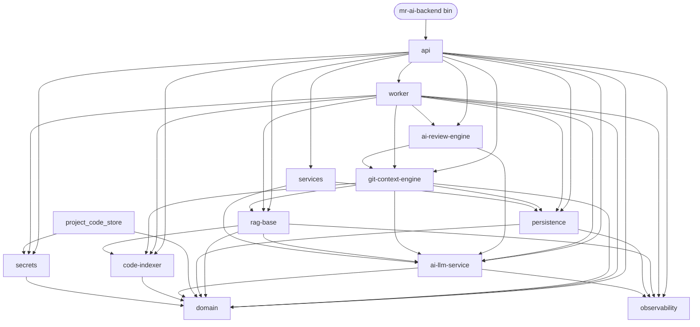

# Architecture Overview

> **Purpose.** Map of how the workspace is organised, who depends on whom,
> and which cross-cutting concerns ride above the crate layout. Read this
> once, link to it from PR descriptions whenever the topology changes.

## What this service does

mr-ai-backend is a self-hosted MR/PR review service: it ingests source
code from one or more git providers (GitLab, GitHub, Bitbucket), keeps a
hybrid Postgres-graph + Qdrant-vector index of every project, and on
each merge request publishes AI-generated review comments built from
the diff plus retrieved context. The same workspace also exposes a
`/retrieve` admin API so external tooling can reuse the same
multi-tenant retrieval stack. Cross-repo (monorepo-style) MR review
across N repositories and multiple providers is supported via overlay
BFS + linked-MR discovery (sprints M1–M5).

## Crate dependency graph

The workspace has **13 crates**. Edges are real `[dependencies]`
entries (see each crate's `Cargo.toml`); the binary `mr-ai-backend`
only depends on `api`, which transitively wires the rest.

Notes:

- `project_code_store` is not pulled in by `api` directly — it is used
  by handlers in `worker` via the bundled `git-service` subcrate.
- `services` is the small shared-utilities crate (UUIDv5 helper,
  background monitors); not to be confused with the `docs/services/`
  folder, which contains a page per crate.
- The dependency direction is strictly top-down. Cycles are caught at
  `cargo build`.

## Layered model

| Layer | Crates | Concern |
| --- | --- | --- |
| **L4 — Entrypoint** | `mr-ai-backend` (binary), `api` | HTTP framing, routing, request validation, tenant extraction, app-state wiring. |
| **L3 — Orchestration** | `worker`, `ai-review-engine`, `git-context-engine` | Job pool + per-kind handlers; stitch git context + RAG + LLM + comment publishing into a workflow. |
| **L2 — Capabilities** | `rag-base`, `code-indexer`, `project_code_store`, `services` | Self-contained capabilities: semantic search over Qdrant, AST chunking, async git cloning, shared helpers. |
| **L1 — Infrastructure** | `ai-llm-service`, `persistence`, `observability`, `secrets` | Provider-agnostic LLM gateway, Postgres pool / migrations / repos, telemetry init + Prometheus / OTLP, secret provider abstraction. |
| **L0 — Domain** | `domain` | Pure data types: `AuthorizedScope`, `ProjectId`, `IngestionEvent`, `ReviewBundle`, identity helpers. No IO. |

Every crate at layer N may import only from layers `< N`. The graph
above is the source of truth; the table is the human-readable
summary.

## Cross-cutting concerns

### Multi-tenant isolation (sprints C1–C5)

- **Identity at the edge.** Every admin / retrieve / trigger request
  carries `X-Project-Slug`; the `extract_tenant` middleware resolves
  it to an `AuthorizedScope` (`domain::scope`) and stores it in the
  request extensions.
- **Intended perimeter.** `AuthorizedScope` is a marker type designed
  to make tenant identity a compile-time argument for every repo
  function — handlers should accept `&AuthorizedScope` instead of a
  bare `ProjectId`.
- **Actual enforcement.** Today the runtime perimeter is
  `persistence::tenant::with_tenant(pool, scope, |tx| …)`, which sets
  `app.current_project` on the transaction so Postgres **row-level
  security** policies filter every read and write. The C4 audit
  identified 8 repo functions still taking a bare `&PgPool`; these
  rely on RLS catching mistakes rather than the type system. Treat
  `AuthorizedScope` as aspirational coverage, not a guarantee.
- **Worker re-verification.** The worker re-resolves
  `remote_url → project_id` at claim time and force-kills any job
  whose payload `project_id` disagrees (see
  `worker::process_one::tenant.mismatch`).

See [services/multi-tenant](../services/multi-tenant.md) for the
end-to-end story.

### Cross-repo MR review (sprints M1–M5)

A merge request in one repo can touch symbols defined in sibling
repos of the same project group. `git-context-engine` builds a
transient `OverlayGraph` keyed by `project_group_id`, runs BFS
expansion across repo boundaries, and discovers **linked MRs** in
sibling repos via provider APIs so the review prompt sees the full
multi-repo change set. The flow is BETA and is bounded to a
`project_group` declared in `projects.toml`.

See [services/multi-repo-review](../services/multi-repo-review.md)
and [services/overlay](../services/overlay.md).

### Observability (sprints O1–O4)

- `observability::install_prometheus_recorder()` is installed once at
  boot; `/metrics` serves the Prometheus snapshot.
- `#[instrument]` spans + W3C `traceparent` propagation; OTLP export
  is opt-in via env (`OTEL_EXPORTER_OTLP_ENDPOINT`).
- Admin routes are wrapped by `observability::audit_layer`, which
  writes `request_id`, route, status, latency and payload SHA to the
  `audit_log` table (retention controlled by `AUDIT_RETENTION_DAYS`).
- `/health/dashboard` returns a cached snapshot refreshed every
  `DASHBOARD_REFRESH_SECS` so an ops UI can poll cheaply.

See [guides/observability](../guides/observability.md) and
[services/observability](../services/observability.md).

## Key flows

End-to-end sequence diagrams (push ingestion, MR review, cross-repo
overlay, `/retrieve`) live in [Data Flow](data-flow.md). One-liners:

- **Index a project** → webhook → `worker::IngestPush` →
  `code-indexer` chunks → `persistence` writes graph nodes/edges →
  `rag-base` upserts vectors to Qdrant.
- **Review an MR** → webhook → `worker::IngestMr` →
  `git-context-engine` builds overlay + review targets → `rag-base`
  retrieves context → `ai-review-engine` runs per-hunk prompts →
  comments published via provider API.
- **Retrieve** → `POST /retrieve` (admin auth + tenant extraction) →
  `rag-base` master search ∪ MR overlay → optional rerank
  (`rerank_cache` keyed by query+chunk SHA).

## Configuration philosophy

- **Single source of truth.** `.env` at the workspace root plus
  `projects.toml` (project groups + per-repo remotes). No code has
  hard-coded endpoints, models, or pricing.
- **Typed, validated upfront.** `AppConfig::from_env()` and
  `GatewayConfig::from_env()` parse everything once at startup;
  downstream code receives strongly-typed structs.
- **Secrets through a provider.** `secrets::from_env()` picks an env
  or file-mount backend; rotation does not require a restart of
  callers that re-read on every use.

Full reference: [guides/configuration](../guides/configuration.md).

## Related docs

- [Data Flow](data-flow.md) — sequence diagrams for the main flows.
- [services/multi-tenant](../services/multi-tenant.md) — tenant perimeter deep-dive.
- [services/multi-repo-review](../services/multi-repo-review.md) — M1–M5 design.
- [guides/getting-started](../guides/getting-started.md) — local setup.
