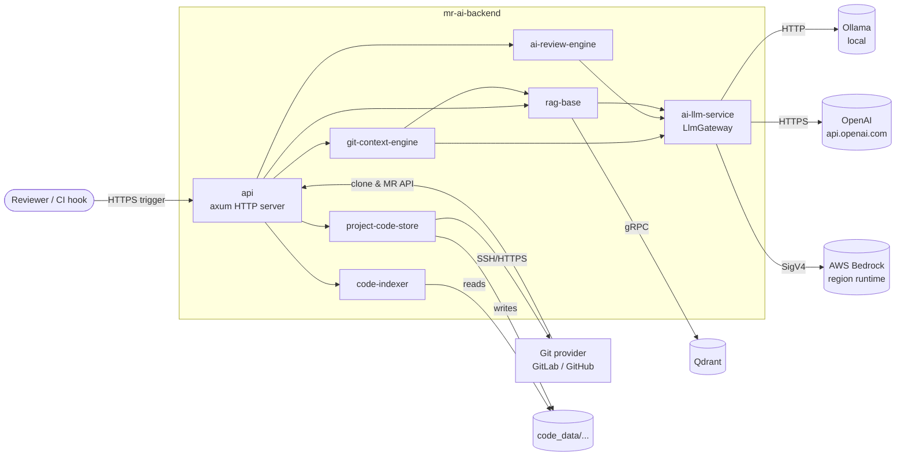

# Architecture Overview

> **Purpose.** Map of how the workspace is organised, who depends on whom,
> and which layer owns which concern. Read this once, link to it from PR
> descriptions whenever the topology changes.

## System context

## Layered model

The workspace is intentionally split so that "how to talk to AI" is separate
from "how to run a review". Each layer below depends only on the ones beneath
it.

| Layer | Crates | Concern |
| --- | --- | --- |
| **L4 — Transport** | `api` | HTTP framing, routing, request validation, app state wiring. |
| **L3 — Orchestration** | `ai-review-engine`, `git-context-engine` | Stitch git context + RAG + LLM + comment publishing into a workflow. |
| **L2 — Capabilities** | `rag-base`, `code-indexer`, `project-code-store` | Self-contained capabilities: semantic search, AST parsing, git cloning. |
| **L1 — AI Gateway** | `ai-llm-service` | Provider-agnostic chat completion and embeddings via traits. |
| **L0 — Utilities** | `services` | Tiny cross-cutting helpers (UUIDv5). |

The dependency direction is **strictly top-down**. L1 never imports anything
from L2/L3/L4. L2 may use L1 (rag-base now consumes the gateway for
embeddings). Violations show up as cyclic crate deps in `cargo build`.

## Why a Universal LLM Gateway

`ai-llm-service` exists for two reasons:

1. **Decouple business logic from vendor JSON.** The review engine never
   touches `/api/chat` versus `/v1/chat/completions` versus Bedrock Converse
   — it speaks `UnifiedRequest` and `UnifiedResponse` only.
2. **Centralise observability and cost controls.** Token counting, cost
   estimation, structured logging, and health probes happen exactly once,
   inside the gateway. New providers inherit them automatically.

See [services/ai-llm-service](../services/ai-llm-service.md) for the
deep-dive and [guides/add-llm-provider](../guides/add-llm-provider.md) for
the extension recipe.

## Data flow at a glance

The two main flows are described in detail in
[Data Flow](data-flow.md). In one sentence each:

- **Index a project** → `project-code-store` clones the repo →
  `code-indexer` walks files, builds AST chunks, writes JSONL →
  `rag-base` reads JSONL, asks the gateway for embeddings, upserts to Qdrant.
- **Review an MR** → `git-context-engine` fetches the MR bundle and builds
  review targets → `rag-base` retrieves relevant code via semantic search
  → `git-context-engine` runs a pre-review planning prompt (smart tier) →
  `ai-review-engine` runs the per-hunk review prompt (fast tier) →
  comments are published back to the MR.

## Configuration philosophy

- **Single source of truth.** `.env` at the workspace root is the only
  runtime configuration. No code has hard-coded endpoints, models, or
  pricing.
- **Typed, validated upfront.** `GatewayConfig::from_env()` parses
  everything once at startup; downstream code receives strongly-typed
  structs and never re-reads env vars.
- **Provider-specific knobs in `extras`.** New providers can extend
  configuration without modifying `ProviderConfig` (e.g., AWS region lives
  in `cfg.extras["region"]`).

Full reference: [guides/configuration](../guides/configuration.md).

## Related docs

- [Data Flow](data-flow.md) — sequence diagrams for the two main flows.
- [services/ai-llm-service](../services/ai-llm-service.md) — gateway internals.
- [guides/getting-started](../guides/getting-started.md) — local setup.
