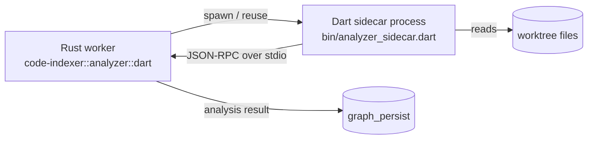

# Dart Analyzer sidecar

Tree-sitter gives us a fast, robust syntax tree but no semantic model. The
Dart Analysis Server (LSP) gives us symbols/types/refs but not the
fine-grained control-flow / data-flow facts we need for the higher-quality
edge kinds (`data_flow`, `control_flow`, precise `async_boundary`). The
**Dart Analyzer sidecar** fills the gap.

> Status (S8): **shipped — skeleton with stub extractors**. The
> [Dart package](../../dart_sidecar) is in the tree; the
> [Rust client](../../code-indexer/src/lsp/dart/sidecar.rs) drives it;
> [`augment_with_sidecar`](../../code-indexer/src/analyzer/dart.rs)
> folds the result into `AnalysisOutcome`; the
> [`ReindexHandler`](../../worker/src/handlers.rs) opts in when configured.
> The Dart-side `_extractDataFlow` / `_extractControlFlow` /
> `_extractAsyncBoundary` are placeholders — replacing them with real
> `package:analyzer` AstVisitor passes is the next item in the queue.

## Why a separate process

`package:analyzer` is the same library `dart analyze`, the IDE plugin and
the language server are built on. It owns full semantic resolution: types,
elements, references, and the AST visitors required to derive CFG/DFG.
Calling it requires the Dart VM, which we keep out of the Rust binary by
running it as a sidecar process.

## Architecture



- **Lifecycle** — one sidecar per `GitService`. The Rust side starts it on
  first request, restarts it on crashes, and graceful-shutdowns it when
  the worker pool drains.
- **Transport** — Content-Length-framed JSON-RPC on stdio (same protocol
  shape as LSP, but a minimal request/response set — no async server
  features).
- **Concurrency** — single-threaded inside Dart (the analyzer driver is
  not thread-safe). The Rust caller serialises requests through a
  `tokio::sync::Mutex` per sidecar instance.

## RPC surface (planned)

| Method | Request | Response |
| --- | --- | --- |
| `initialize` | `{ workspace: <path>, dart_sdk?: <path> }` | `{ analyzer_version, dart_version, supports: ["cfg","dfg","references"] }` |
| `extractEdges` | `{ files: [<path>], kinds: ["data_flow","control_flow","async_boundary"] }` | `{ edges: [...], coverage: {...} }` |
| `shutdown` | `{}` | `{}` |

Edge entries match the in-memory shape:

```json
{
  "from_fqn": "lib/main.dart::AppRouter::goToHome",
  "to_fqn":   "lib/main.dart::AppRouter::_resolve",
  "edge_type": "control_flow",
  "weight": 1.0,
  "meta": { "branch": "if-true", "line": 42 }
}
```

## Running it locally

```bash
# 1. Install Dart SDK 3.3+.
# 2. Resolve sidecar deps once (fetches package:analyzer):
cd dart_sidecar && dart pub get
# 3. Tell the Rust worker to launch it:
export DART_SIDECAR_DART_ENTRYPOINT=$(pwd)/bin/analyzer_sidecar.dart
# OR build a standalone binary and point at that:
# dart compile exe bin/analyzer_sidecar.dart -o /usr/local/bin/mr_ai_dart_sidecar
# export DART_SIDECAR_BINARY=/usr/local/bin/mr_ai_dart_sidecar
```

When neither variable is set, [`SidecarClient::start`](../../code-indexer/src/lsp/dart/sidecar.rs)
returns `Disabled` and the analyzer falls back to its tree-sitter-only
path. The worker logs `Reindex: sidecar disabled` and continues.

## Configuration

| Var | Default | Purpose |
| --- | --- | --- |
| `DART_SIDECAR_BINARY` | unset | Absolute path to a compiled sidecar executable. Preferred in production. |
| `DART_SIDECAR_DART_ENTRYPOINT` | unset | Absolute path to `bin/analyzer_sidecar.dart`. The Rust worker spawns `dart run <entrypoint>`. Convenient for development. |
| `DART_SDK` | unset | Optional override forwarded into the sidecar's `initialize` params. |

## Coverage gap until S3-D

| Edge | Today | After sidecar |
| --- | --- | --- |
| `imports`, `defines`, `calls`, `inherits`, `type_uses` | ✅ tree-sitter / chunk graph | ✅ same — sidecar fills missing references |
| `async_boundary` | ⚠️ LSP-tag heuristic | ✅ exact `await`/`Future` boundaries |
| `data_flow` | ❌ | ✅ intra-procedural (def → use), inter-procedural via Element model |
| `control_flow` | ❌ | ✅ basic-block edges with branch labels |

`DartAnalyzer` is wired so the missing edges materialise transparently
once the sidecar is plugged in — no schema or pipeline change needed.

## Related docs

- [Graph RAG](../services/graph-rag.md)
- [code-indexer service](../services/code-indexer.md)
- [Database schema](../reference/database-schema.md)
