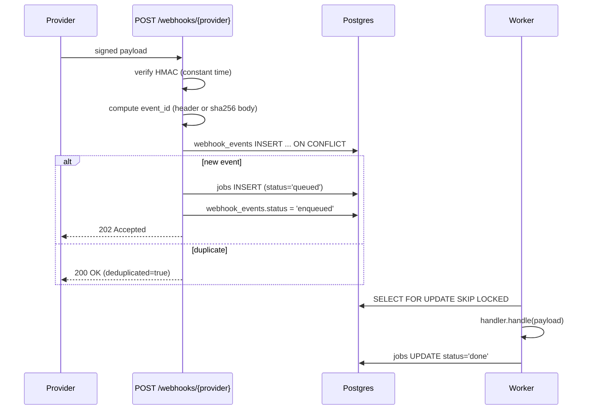

# Webhooks

S2 introduces three native per-provider webhook endpoints. They verify the
inbound signature, deduplicate retries, and enqueue a job for the worker
pool to process. The legacy `/trigger_git_mr` shared-secret endpoint is
preserved as a manual replay/debug fallback.

## Endpoints

| Path | Provider | Auth header | Body signature scheme |
| --- | --- | --- | --- |
| `POST /webhooks/gitlab` | GitLab | `X-Gitlab-Token` | shared secret, plain text |
| `POST /webhooks/github` | GitHub | `X-Hub-Signature-256` | `sha256=<hex>` HMAC-SHA256 |
| `POST /webhooks/bitbucket` | Bitbucket Server | `X-Hub-Signature` | `sha256=<hex>` HMAC-SHA256 |

> Bitbucket Cloud has no built-in HMAC. Front it with a reverse proxy that
> adds `X-Hub-Signature` from the same shared secret. See
> [`secrets/src/webhook.rs`](../../secrets/src/webhook.rs) for the
> verification helpers.

Sprint M1 of cross-repo MR review split the single shared HMAC
into **per-provider secrets** so a leak of one provider's key
never compromises the others:

| Handler | SecretProvider key | Env |
|---|---|---|
| `/webhooks/gitlab` | `webhook_hmac_gitlab` | `GITLAB_WEBHOOK_SECRET` |
| `/webhooks/github` | `webhook_hmac_github` | `GITHUB_WEBHOOK_SECRET` |
| `/webhooks/bitbucket` | `webhook_hmac_bitbucket` | `BITBUCKET_WEBHOOK_SECRET` |

There is **no global fallback** — deployments upgrading from
the legacy `WEBHOOK_HMAC_SECRET` must set the per-provider keys
for the providers they use.

## Registering a webhook at the provider

After setting the appropriate `*_WEBHOOK_SECRET` env var and declaring
the repo in `projects.toml`, register the webhook in the provider UI.

### GitLab

1. Project → **Settings → Webhooks**.
2. URL: `https://<your-api-host>/webhooks/gitlab`
3. Secret token: the **exact** value of `GITLAB_WEBHOOK_SECRET`.
4. Trigger events: ✅ `Push events`, ✅ `Merge request events`.
   Leave the rest off (anything else is acknowledged but does no
   work — see "Recognised events" below).
5. ✅ Enable SSL verification.
6. Click **Add webhook**, then **Test → Push events** — the API
   should respond `202 Accepted` and a row should appear in
   `webhook_events`.

### GitHub

1. Repo → **Settings → Webhooks → Add webhook**.
2. Payload URL: `https://<your-api-host>/webhooks/github`
3. Content type: `application/json` (required — form-encoded payloads
   are rejected).
4. Secret: the **exact** value of `GITHUB_WEBHOOK_SECRET`.
5. Which events: select **Let me select individual events** →
   ✅ `Pushes`, ✅ `Pull requests`. GitHub auto-pings on creation;
   the API replies `200 OK` to `ping` events without enqueuing.
6. ✅ Active. Click **Add webhook**.

### Bitbucket Server

1. Repo → **Repository settings → Webhooks → Create webhook**.
2. URL: `https://<your-api-host>/webhooks/bitbucket`
3. Secret: the value of `BITBUCKET_WEBHOOK_SECRET`.
4. Events: ✅ `Repository - Push`, ✅ `Pull request - Opened`,
   ✅ `Pull request - Source branch updated`.

> **Bitbucket Cloud has no native HMAC signing.** Either accept
> unsigned webhooks (NOT recommended — anyone with the URL can spoof
> them), or front the API with a reverse proxy that derives
> `X-Hub-Signature` from the request body + shared secret. The
> verification path doesn't care where the header came from, as long
> as it matches.

## Pipeline



## Recognised events

| Provider | Inbound | Job kind |
| --- | --- | --- |
| GitLab | `Push Hook` / `Tag Push Hook` | `IngestPush` |
| GitLab | `Merge Request Hook` | `IngestMr` |
| GitHub | `push` | `IngestPush` |
| GitHub | `pull_request` | `IngestMr` |
| GitHub | `ping` | (ack-only, no job) |
| Bitbucket | `repo:push` | `IngestPush` |
| Bitbucket | `pullrequest:created` / `pullrequest:updated` | `IngestMr` |

Anything else is recorded in `webhook_events` for audit and acknowledged
without a job.

## Idempotency

Every event is keyed in `webhook_events` by `(provider, event_id)`:

- GitLab: `X-Gitlab-Event-UUID` if present, else `sha256:<body-hash>`.
- GitHub: `X-GitHub-Delivery`, else `sha256:<body-hash>`.
- Bitbucket: `X-Request-UUID` / `X-Hook-UUID`, else `sha256:<body-hash>`.

Duplicate deliveries short-circuit with HTTP `200 OK` and
`{"duplicate": true}` in the response body. The response shape is:

```json
{
  "event_id": "f3b8…",
  "duplicate": false,
  "enqueued_kind": "IngestMr"
}
```

## Repo resolution

Every push/MR event must point at a `project_repos.remote_url` known to the
system. The handler attempts a verbatim match first, then a `.git`-suffix
toggle (covers SSH ↔ HTTPS form drift). When nothing matches, the event is
recorded with `status='rejected'` and the response is `422` with code
`UNKNOWN_REPO`.

To register a repo, edit `projects.toml` (replicated into Postgres at boot).
See [Configuration → Project group config](configuration.md#project-group-config).

## Failure modes

| Status | Code | When |
| --- | --- | --- |
| 401 | `WEBHOOK_SIGNATURE_INVALID` | HMAC mismatch |
| 400 | `WEBHOOK_BAD_BODY` | non-JSON payload |
| 422 | `UNKNOWN_REPO` | repo URL is not in any project group |
| 503 | `PERSISTENCE_DISABLED` | `DATABASE_URL` not set |
| 503 | `WEBHOOK_SECRET_UNSET` | provider-specific webhook secret not configured (e.g. `GITLAB_WEBHOOK_SECRET`) |
| 500 | `PERSISTENCE_ERROR` | sqlx / migration error |

## Local test recipe

```bash
# 1. Pick a registered repo URL from projects.toml.
URL="git@gitlab.com:org/app.git"
SECRET=$(grep GITLAB_WEBHOOK_SECRET .env | cut -d= -f2)  # or GITHUB_WEBHOOK_SECRET / BITBUCKET_WEBHOOK_SECRET

# 2. Build a minimal GitLab MR payload.
BODY=$(cat <<EOF
{"object_kind":"merge_request","project":{"git_ssh_url":"$URL"},
 "object_attributes":{"iid":42,"source_branch":"feat","target_branch":"main",
                      "last_commit":{"id":"deadbeef"}}}
EOF
)

# 3. POST it.
curl -sS -X POST http://localhost:8080/webhooks/gitlab \
  -H "Content-Type: application/json" \
  -H "X-Gitlab-Token: $SECRET" \
  -H "X-Gitlab-Event: Merge Request Hook" \
  -H "X-Gitlab-Event-UUID: 11111111-2222-3333-4444-555555555555" \
  -d "$BODY"
```

Replay the same call to verify dedup (response toggles `duplicate: true`).

## Related docs

- [Job queue](../reference/job-queue.md) — what happens after the event is
  enqueued.
- [Git service](../services/git-service.md) — bare clones and worktrees
  used by the workers.
- [Database schema](../reference/database-schema.md) — `webhook_events`,
  `jobs` columns.
