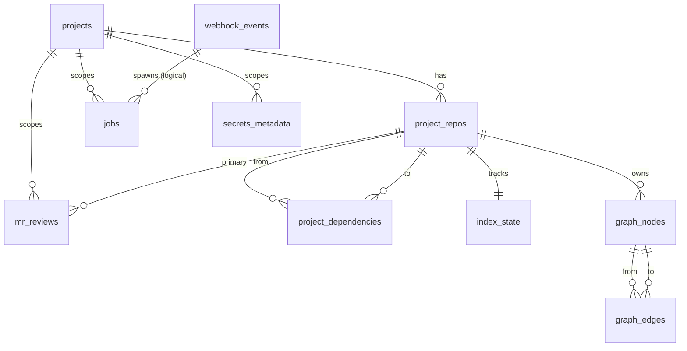

# Database Schema

`mr-ai-backend` uses Postgres 16 as the system-of-record for project
metadata, MR review state, the job queue, webhook event log, and the code
graph (S3+). Vector data lives separately in Qdrant; nothing in this schema
duplicates it.

## External stores

| Store | Role | Reference |
| --- | --- | --- |
| Postgres (this page) | OLTP truth: projects, repos, queue, graph nodes/edges. | — |
| **Qdrant** | Vector index of code chunks; payload carries `project_id` / `repo_id` / `chunk_kind` / `parent_symbol_id` / `content_sha256` so tenancy, hierarchy, and dedup are all enforced in-payload, not by collection segregation. | [Qdrant Schema](qdrant-schema.md) |


Migrations live in [`persistence/migrations/`](../../persistence/migrations)
and are managed via `sqlx-cli`.

## Sprint scope

| Range | Sprint | Tables |
| --- | --- | --- |
| `0001..0006` | **S1** | projects, project_repos, project_dependencies, webhook_events, jobs, mr_reviews, secrets_metadata, index_state |
| `0007`       | **S2** | `index_state.last_indexed_path_prefix` resume checkpoint (S9 wires the producer). |
| `0010..0011` | **S3** | graph_nodes, graph_edges |
| `0012` | S3-D | (sidecar-derived data_flow / control_flow markers, when they land) |
| `0013..0014` | S4 | overlay metrics, delta tracking |
| `0015+`      | S5 | retention TTLs, cleanup |

This page documents S1 + S3.

## Tables (S1)

### `projects`

Top-level logical project. Slug is the stable handle used by `projects.toml`,
secret scoping, and filesystem caches.

| Column | Type | Notes |
| --- | --- | --- |
| `id` | UUID PK | `gen_random_uuid()` default. |
| `slug` | TEXT UNIQUE | Matches `[[project]] slug` in `projects.toml`. |
| `name` | TEXT | Human-readable display name. |
| `created_at` / `updated_at` | TIMESTAMPTZ | Auto-set; `updated_at` rewritten on slug-conflict upsert. |

### `project_repos`

One row per repository inside a group.

| Column | Type | Notes |
| --- | --- | --- |
| `id` | UUID PK | |
| `project_id` | UUID FK → projects.id | `ON DELETE CASCADE`. |
| `provider` | TEXT CHECK | One of `gitlab`, `github`, `bitbucket`. |
| `remote_url` | TEXT | SSH or HTTPS clone URL. |
| `default_branch` | TEXT | Defaults to `'main'`. |
| `is_primary` | BOOLEAN | Exactly one row per project should be primary; the loader auto-promotes the first repo when none is flagged. |
| `created_at` | TIMESTAMPTZ | |
| | | Unique `(project_id, remote_url)`. |

Index: `project_repos_project_id_idx` on `(project_id)`.

### `project_dependencies`

Directed edges between repos in the same project. Used in S2 to fan out a
single MR webhook into a multi-repo `ReviewBundle`.

| Column | Type | Notes |
| --- | --- | --- |
| `from_repo_id` | UUID FK → project_repos.id | `ON DELETE CASCADE`. |
| `to_repo_id` | UUID FK → project_repos.id | `ON DELETE CASCADE`. |
| `kind` | TEXT | Source of the declaration: `manual`, `pubspec`, `cargo`, `package_json`, etc. |
| | | Composite PK `(from_repo_id, to_repo_id, kind)`. |

### `webhook_events`

Idempotency log for inbound webhooks. Lookup by `(provider, event_id)`
short-circuits duplicate deliveries.

| Column | Type | Notes |
| --- | --- | --- |
| `id` | UUID PK | |
| `provider` | TEXT CHECK | `gitlab` / `github` / `bitbucket`. |
| `event_id` | TEXT | Provider-supplied ID (e.g. `X-Gitlab-Event-UUID`). |
| `event_kind` | TEXT | `push`, `merge_request`, `ping`, … |
| `payload_hash` | BYTEA | SHA-256 of the raw body. |
| `payload` | JSONB | Verbatim payload after HMAC verification. |
| `received_at` | TIMESTAMPTZ | |
| `status` | TEXT CHECK | `received` → `enqueued` → (`rejected` | `failed`). |
| | | Unique `(provider, event_id)`. |

Index: `webhook_events_received_at_idx` (DESC) for audit queries.

### `jobs`

Postgres-backed queue. Workers claim with
`SELECT ... FROM jobs WHERE status='queued' AND run_at <= now() FOR UPDATE SKIP LOCKED`.

| Column | Type | Notes |
| --- | --- | --- |
| `id` | UUID PK | |
| `project_id` | UUID nullable FK → projects.id | `ON DELETE SET NULL`. |
| `kind` | TEXT | `IngestPush`, `IngestMr`, `Reindex`, … |
| `payload` | JSONB | Job-specific JSON. |
| `status` | TEXT CHECK | `queued` / `running` / `done` / `failed` / `dead`. |
| `attempt` | INT | Increments on each retry. |
| `max_attempts` | INT | Default 5. |
| `run_at` | TIMESTAMPTZ | Earliest pickup time (used for backoff). |
| `locked_at` / `locked_by` | TIMESTAMPTZ / TEXT | Worker that holds the row. |
| `last_error` | TEXT | Truncated diagnostic. |
| `created_at` / `finished_at` | TIMESTAMPTZ | |

Indexes: `jobs_pickup_idx (status, run_at) WHERE status='queued'`,
`jobs_project_id_idx (project_id)`.

### `mr_reviews`

State for an in-flight or completed review.

| Column | Type | Notes |
| --- | --- | --- |
| `id` | UUID PK | |
| `project_id` | UUID FK → projects.id | `ON DELETE CASCADE`. |
| `primary_repo_id` | UUID FK → project_repos.id | `ON DELETE CASCADE`. |
| `mr_iid` | TEXT | Provider-side identifier. |
| `status` | TEXT CHECK | `pending` / `running` / `published` / `failed`. |
| `bundle` | JSONB | Snapshot of the `ReviewBundle` fed to the LLM. |
| `started_at` / `finished_at` | TIMESTAMPTZ | |
| | | Unique `(primary_repo_id, mr_iid)`. |

Index: `mr_reviews_project_status_idx (project_id, status)`.

### `secrets_metadata`

Pointer table — never plaintext. Records *where* a secret lives.

| Column | Type | Notes |
| --- | --- | --- |
| `id` | UUID PK | |
| `project_id` | UUID nullable FK → projects.id | `ON DELETE CASCADE`. |
| `key` | TEXT | Logical key (e.g. `git_token`). |
| `backend` | TEXT CHECK | `env` / `file` / `vault`. |
| `location` | TEXT | Env-var name / file path / Vault path. |
| `rotated_at` | TIMESTAMPTZ | |
| | | Unique `(project_id, key)`. |

### `index_state`

One row per indexed repo; tracks the last fully-indexed commit so the
incremental delta updater (S4) can compute `last_indexed_sha → HEAD`.

| Column | Type | Notes |
| --- | --- | --- |
| `repo_id` | UUID PK FK → project_repos.id | |
| `last_indexed_sha` | TEXT | |
| `last_indexed_at` | TIMESTAMPTZ | |
| `last_error` | TEXT | |
| `last_indexed_path_prefix` | TEXT | S2 column, populated by the S9 timeout / auto-split path so a long Reindex can resume mid-walk; cleared by `mark_indexed`. |

## Tables (S3 — graph layer)

### `graph_nodes`

Addressable code entity (file, package, class, method, field, …). The
language analyzer produces these via [`LanguageAnalyzer::analyze_chunks`](../../code-indexer/src/analyzer/mod.rs)
and they are persisted by [`graph_persist::persist_graph`](../../persistence/src/graph_persist.rs).

| Column | Type | Notes |
| --- | --- | --- |
| `id` | UUID PK | Surrogate identity stable across re-indexing. |
| `repo_id` | UUID FK → project_repos.id | `ON DELETE CASCADE`. |
| `fqn` | TEXT | Stable identity inside a repo (e.g. `lib/main.dart::AppRouter::goToHome`). |
| `kind` | TEXT | One of file/package/module/class/interface/mixin/extension/enum/function/method/constructor/field/variable/typedef + `Custom`. |
| `file` | TEXT | Repo-relative file path. |
| `symbol` | TEXT | Short name. |
| `language` | TEXT | Language tag (`dart`, `rust`, `unknown` for placeholders). |
| `content_sha256` | TEXT | Hash of the chunk body that defined the node. |
| `span_start` / `span_end` | INTEGER | Byte offsets within the file. |
| `created_at` / `updated_at` | TIMESTAMPTZ | Auto-set; `updated_at` rewritten on upsert. |
| | | Unique `(repo_id, fqn)`. |

Indexes: `graph_nodes_repo_kind_idx (repo_id, kind)`, `graph_nodes_file_idx
(repo_id, file)`, `graph_nodes_symbol_idx (symbol)`.

### `graph_edges`

Directed edges keyed by `(from_node, to_node, edge_type)`.

| Column | Type | Notes |
| --- | --- | --- |
| `id` | BIGSERIAL PK | Surrogate. |
| `from_node` / `to_node` | UUID FK → graph_nodes.id | `ON DELETE CASCADE`. |
| `edge_type` | TEXT | `imports` / `defines` / `calls` / `inherits` / `type_uses` / `package_dep` / `data_flow` / `control_flow` / `async_boundary` (+ language-specific custom). |
| `weight` | REAL | Default `1.0`; analyzers set `0.7` for soft relations like `with` / `implements`. |
| `meta` | JSONB | Optional small payload (call-site row, alias, branch label). |

Indexes: `graph_edges_from_idx`, `graph_edges_to_idx`, `graph_edges_type_idx`.

## Migration workflow

```bash
# Apply pending migrations:
just db-migrate

# Rewind one migration (LOCAL DEV ONLY — never in production):
just db-revert

# Refresh the offline bundle so CI can build with SQLX_OFFLINE=true:
just db-prepare

# Drop, recreate, migrate from scratch:
just db-reset
```

### Conventions

- One logical change per migration. **Never edit a merged migration** — write
  a new one.
- Every `*.up.sql` ships a matching `*.down.sql`. Down migrations are local
  dev only; production never runs them.
- File naming: `<YYYYMMDD>_<NNNN>_<short_name>.<up|down>.sql`. The numeric
  prefix gates ordering.
- Use `IF NOT EXISTS` / `IF EXISTS` so reapplied migrations are a no-op.

## ER diagram



## Related docs

- [Configuration](../guides/configuration.md)
- [Installation](../guides/installation.md)
- [Secrets](../guides/secrets.md)
