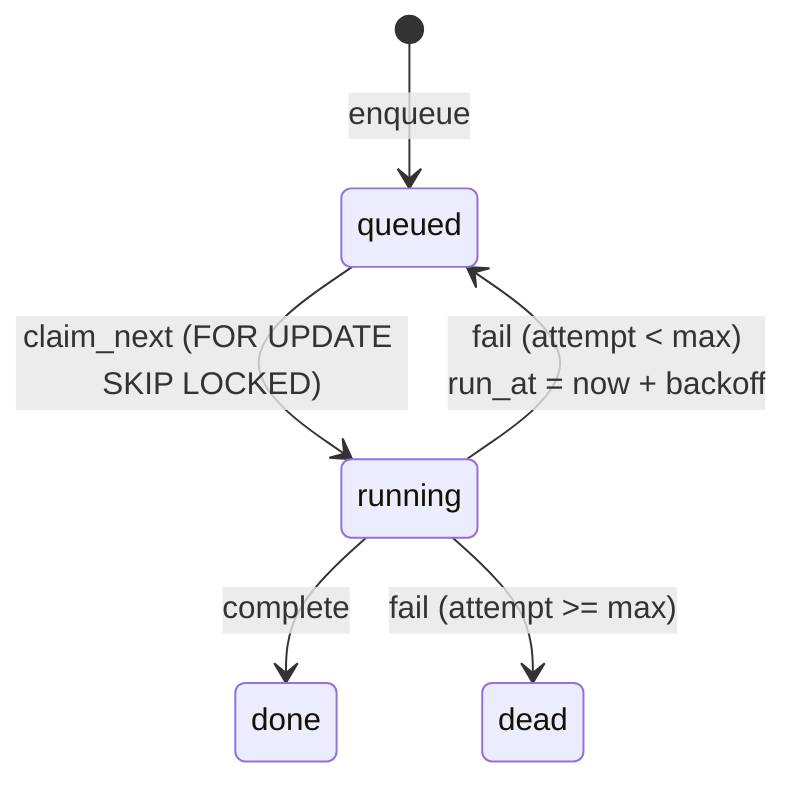
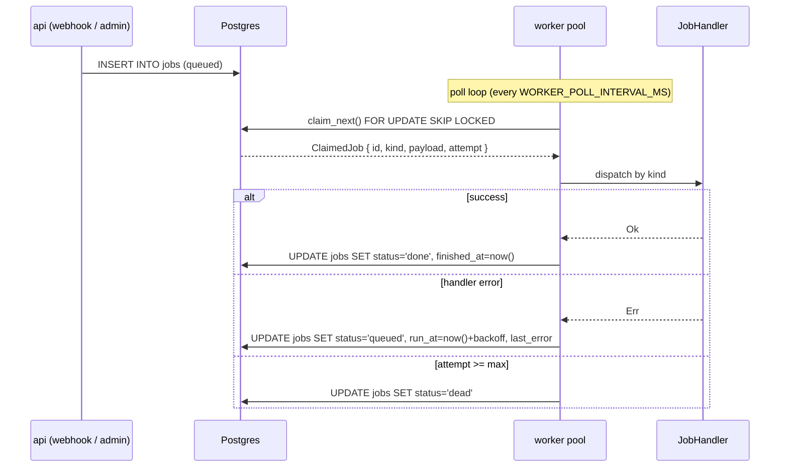

# Job Queue

Postgres-backed queue used by `worker/`. Single table, claimed via
`FOR UPDATE SKIP LOCKED`. No Redis, no external broker.

For the connection pool, transaction patterns, and observability story
see [services/persistence](../services/persistence.md). For the row
schema see [`jobs` in database-schema](database-schema.md#jobs).

## State machine



Invariants:

- `attempt` is incremented inside the same UPDATE that flips
  `status='running'` so concurrent workers can't drift past
  `max_attempts`.
- Pickup uses partial index `jobs_pickup_idx (status, run_at) WHERE
  status='queued'` — cheap even with millions of completed rows.

## Claim semantics

```sql
WITH next AS (
    SELECT id FROM jobs
     WHERE status='queued' AND run_at <= now()
     ORDER BY run_at
     FOR UPDATE SKIP LOCKED
     LIMIT 1
)
UPDATE jobs j
   SET status='running', locked_at=now(), locked_by=$1, attempt=attempt+1
  FROM next
 WHERE j.id = next.id
RETURNING j.id, j.project_id, j.kind, j.payload, j.attempt, j.max_attempts;
```

Any number of workers can poll concurrently — each picks a different
row (or nothing) without blocking.

## Retry policy

Failure path bumps `run_at` with exponential backoff
(`initial × 2^(attempt-1)`, capped at `max_backoff`). Defaults in
[`worker/src/lib.rs`](../../worker/src/lib.rs):

| Attempt | Delay |
| --- | --- |
| 1 | 2 s |
| 2 | 4 s |
| 3 | 8 s |
| 4 | 16 s |
| 5 | 32 s |
| ≥6 | 60 s (cap) |

When `attempt >= max_attempts` the row goes to `dead` — no automatic
revival. Manual resurrection:

```sql
UPDATE jobs
   SET status='queued', run_at=now(), attempt=0, last_error=NULL
 WHERE id = '<uuid>';
```

## Kinds

| Kind | Producer | Handler | Pipeline |
| --- | --- | --- | --- |
| `IngestPush` | `/webhooks/*` push events | [`IngestPushHandler`](../../worker/src/handlers/ingest_push.rs) | refresh bare clone → enqueue `Reindex` |
| `IngestMr` | `/webhooks/*` MR events | [`IngestMrHandler`](../../worker/src/handlers/ingest_mr/mod.rs) | resolve provider → build two-phase review bundle → optional inline comments |
| `Reindex` | `IngestPush`, `/admin/reindex_*` (S5), auto-split fan-out (S9) | [`ReindexHandler`](../../worker/src/handlers/reindex/mod.rs) | worktree → multi-language analyzer fan-out → `graph_persist` (Postgres) + `upsert_repo_chunks` (Qdrant, content-sha dedup). Auto-splits at `REINDEX_SPLIT_FILES`, times out at `REINDEX_JOB_TIMEOUT_MIN`. |

Adding a new kind:

1. Implement `JobHandler` in the relevant crate.
2. Add a `&'static str` constant for `kind()` in `worker::handlers`.
3. Register in `default_registry(...)`.
4. Document the payload shape here.

## Configuration

| Var | Default | Purpose |
| --- | --- | --- |
| `WORKER_POOL_SIZE` | `4` | Async tasks polling the queue. |
| `WORKER_POLL_INTERVAL_MS` | `500` | Sleep when there is no work. |
| `REINDEX_JOB_TIMEOUT_MIN` | `30` | Per-job hard timeout (S9). |
| `REINDEX_SPLIT_FILES` | `5000` | Auto-split threshold; `0` disables. |

## End-to-end flow



## Logs

Emitted by `worker::pool` (target = `worker`):

```text
INFO  worker: claimed job kind=Reindex id=4f3a... attempt=1
INFO  worker.handler: Reindex: vector upsert finished upserted=120 kept=4810 deleted=2
WARN  worker: handler failed retry_in_ms=4000 attempt=2 kind=IngestMr
ERROR worker: job moved to dead kind=Reindex attempts=5 last_error="qdrant: connection refused"
```

## Diagnostics

```sql
-- Counts by status.
SELECT status, count(*) FROM jobs GROUP BY status;

-- Stuck rows (running too long).
SELECT id, kind, locked_at, attempt, last_error
  FROM jobs
 WHERE status='running' AND locked_at < now() - interval '10 minutes';

-- Latest dead-letter entries.
SELECT id, kind, last_error, finished_at
  FROM jobs
 WHERE status='dead'
 ORDER BY finished_at DESC NULLS LAST LIMIT 20;

-- Queue depth by kind.
SELECT kind, count(*) FROM jobs WHERE status='queued' GROUP BY kind;
```

## Graceful shutdown

`api::start` holds a `WorkerPool` handle next to the HTTP listener. On
SIGINT the listener drains inflight requests, then `pool.shutdown()`
signals every worker task — each finishes the current job and exits.
Cancellation is cooperative; long-running handlers respect cooperative
yield points and the S9 `REINDEX_JOB_TIMEOUT_MIN` ceiling.

## Related docs

- [services/persistence](../services/persistence.md) — pool, transactions, log targets.
- [services/ingestion-pipeline](../services/ingestion-pipeline.md) — what `Reindex` does end-to-end.
- [services/review-pipeline](../services/review-pipeline.md) — what `IngestMr` does.
- [guides/webhooks](../guides/webhooks.md) — how jobs get into the queue.
