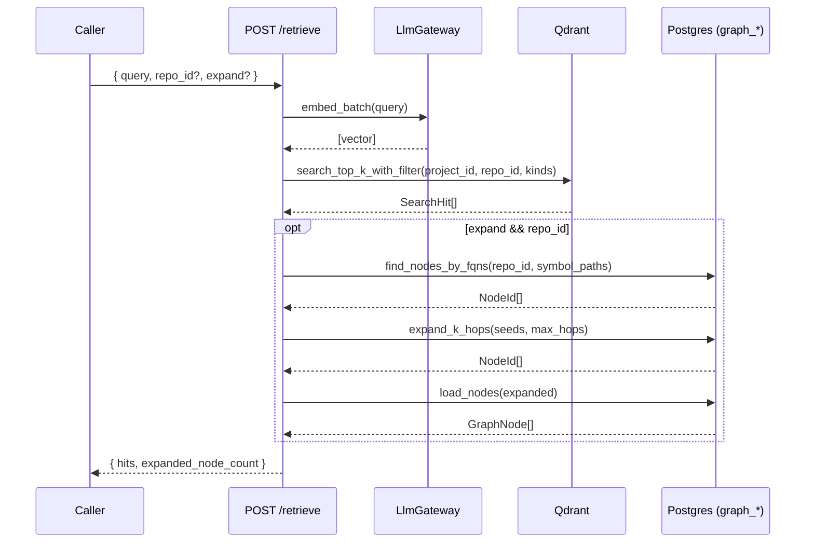
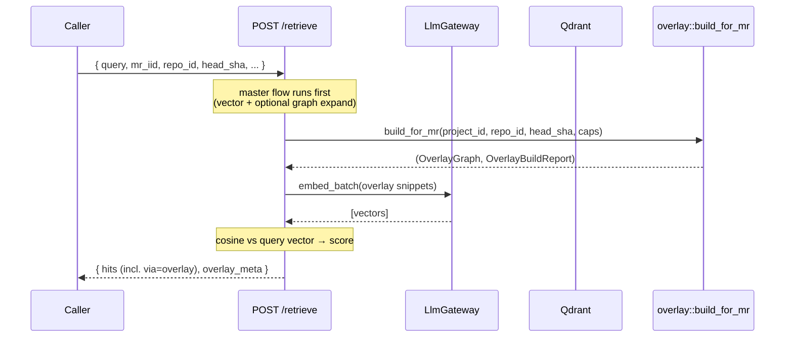

# Retrieve API

> **Status:** STABLE (S8+) ·
> **Route:** [`POST /retrieve`](../../api/src/routes/retrieve/retrieve_route.rs)

`POST /retrieve` is the mechanical retrieval entry point introduced in
S8. It supersedes the legacy `/search_vector_base` route and shapes the
input expected by future LLM rerank / answer-generation work.

The endpoint is **deterministic**: no LLM rerank, no answer generation,
no comment publishing. It returns scored chunks and (optionally) the
graph-expanded / overlay-merged neighbours.

## Authentication

`/retrieve` is an operator route — every request must carry
`X-Admin-Token` matched (constant-time) against
[`AppConfig::trigger_secret`](../../api/src/core/app_state.rs)
(env: `TRIGGER_SECRET`). Missing / wrong / empty header returns
`401 UNAUTHORIZED`. See [Admin API → Authentication](admin-api.md#authentication).

The tenant is resolved per-request via the `X-Project-Slug` header (see
[multi-tenant](../services/multi-tenant.md)); missing / unknown slugs
fail at the middleware layer with `400 MISSING_PROJECT_SLUG` or
`400 UNKNOWN_PROJECT` before the handler runs.

## Request

```http
POST /retrieve
Content-Type: application/json
X-Admin-Token: <TRIGGER_SECRET>
X-Project-Slug: demo

{
  "query": "user authentication middleware",
  "repo_id": "00000000-0000-0000-0000-000000000001",
  "mr_iid": "42",
  "head_sha": "deadbeef",
  "kinds": ["symbol", "parent"],
  "expand": true,
  "max_hops": 1,
  "top_k": 8,
  "min_score": 0.1
}
```

| Field | Type | Default | Notes |
| --- | --- | --- | --- |
| `query` | string | — | Required. The free-form query. |
| `project_slug` | string? | — | **Deprecated** — body field accepted but ignored. The tenant is derived from the `X-Project-Slug` header (see [multi-tenant](../services/multi-tenant.md)). |
| `repo_id` | string? | none | UUID. When unset, the search spans every repo in the default project. Required for graph expansion and MR mode. |
| `mr_iid` | string? | none | MR identifier. Triggers overlay build. |
| `head_sha` | string? | none | Required alongside `mr_iid`. The MR head commit the overlay builder checks out. |
| `kinds` | string[]? | unfiltered | Subset of `file` / `parent` / `symbol` / `sub`. Empty / missing means all kinds. |
| `expand` | bool | `true` | Run graph k-hop expansion from the seed hits. Requires `repo_id`. |
| `max_hops` | int? | `1` | Graph expansion depth. Clamped to `<= 3`. |
| `top_k` | int? | `8` | Vector top-k. Internally fetches `min(top_k * 8, 400)` candidates. |
| `min_score` | float? | `0.0` | Vector score floor; applied before graph expand and overlay merge. |

Unknown fields are rejected (`serde(deny_unknown_fields)`).

## Response

```json
{
  "hits": [
    {
      "chunk_id": "abc...:lib/main.dart:lib/main.dart::App::build:1234abcd",
      "project_id": "...",
      "repo_id": "...",
      "file": "lib/main.dart",
      "symbol_path": "lib/main.dart::App::build",
      "chunk_kind": "symbol",
      "score": 0.87,
      "via": "vector",
      "hops": 0,
      "snippet": "void build(BuildContext context) { ... }"
    }
  ],
  "expanded_node_count": 5,
  "overlay_meta": {
    "visited_repos": 3,
    "overlay_chunks": 12,
    "repos_truncated": false,
    "chunks_truncated": false,
    "failed_repos": 0
  }
}
```

| Field | Notes |
| --- | --- |
| `hits` | Sorted descending by `score`. |
| `hits[].chunk_kind` | `file` / `parent` / `symbol` / `sub` — taken from the Qdrant payload so `kinds` filters round-trip in the response. |
| `hits[].repo_id` | Per-hit repo UUID from the payload; lets callers tell two repos apart even when the request omits `repo_id`. |
| `hits[].via` | `vector` (direct Qdrant hit), `graph` (k-hop expansion), `overlay` (MR-mode), `lexical` (reserved). |
| `hits[].hops` | `0` for direct hits; `1+` when `via=graph`. |
| `hits[].score` (graph) | Inherits a `0.5×` decay of the best seed score so expanded nodes sort against vector hits instead of always landing at `0.0`. |
| `expanded_node_count` | Number of graph nodes the expansion surfaced (may exceed `hits[via=graph].len()` if some were duplicates of vector hits). |
| `overlay_meta` | Present only in MR mode. `*_truncated` signal walker hit `MR_FANOUT_*` caps; `failed_repos` counts repos planned but skipped (worktree / indexer error) — non-zero means partial overlay. |

## Status codes

| Status | Code | When |
| --- | --- | --- |
| `200 OK` | — | Normal success. |
| `400 BAD_REQUEST` | various | Empty `query`, malformed UUID, etc. |
| `400 MISSING_PROJECT_SLUG` / `UNKNOWN_PROJECT` | — | `X-Project-Slug` header missing or not found in the `projects` table (raised by `extract_tenant` middleware). |
| `400 BAD_REPO_ID` | — | `repo_id` is not a valid UUID. |
| `400 MR_PARAMS_INCOMPLETE` | — | `mr_iid` supplied without `repo_id` + `head_sha`. |
| `401 UNAUTHORIZED` | — | Missing / wrong `X-Admin-Token`. |
| `502 EMBED_FAILED` / `EMBED_EMPTY` | — | The LLM gateway returned an error or no vectors. |
| `502 QDRANT_*` | `QDRANT_CONNECT_FAILED`, `QDRANT_SEARCH_FAILED` | Vector store transport / RPC error. |
| `500 OVERLAY_FAILED` | — | Overlay build (worktree / index) errored. |
| `500 EMBED_DIM_MISMATCH` | — | The gateway returned vectors of the wrong dimension. |
| `503 PERSISTENCE_DISABLED` | — | Postgres pool unavailable. |

## Master flow



## MR flow



## Caveats

- `head_sha` is currently required for MR mode. A follow-up will look
  it up from `mr_reviews` so callers can drop the field once the bundle
  carries the SHA reliably.
- The MR-mode embedding pass touches every overlay chunk in batches of
  `QDRANT_BATCH_SIZE` so per-call provider input caps (OpenAI 2048,
  Bedrock Titan 25, …) aren't exceeded. Tune `MR_FANOUT_MAX_CHUNKS`
  (see [Configuration](../guides/configuration.md)) to keep retrieval
  latency bounded.
- The legacy `/search_vector_base` route has been removed; `/retrieve`
  is the only retrieval entry point.
- `RagConfig` is captured once at boot on `AppState::rag_cfg`; updating
  `QDRANT_*` / `EMBEDDING_DIM` / `RAG_*` env vars requires an API
  restart.

## Related docs

- [services/api](../services/api.md)
- [services/graph-rag-retrieval](../services/graph-rag-retrieval.md)
- [services/overlay](../services/overlay.md)
- [reference/qdrant-schema](qdrant-schema.md)
