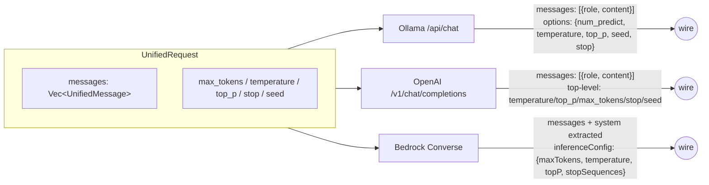

# Reference — Unified Schema

The provider-agnostic types every caller works with. Lives in
[`ai-llm-service/src/unified.rs`](../../ai-llm-service/src/unified.rs).

## Roles & messages

```rust
pub enum Role { System, User, Assistant }

pub struct UnifiedMessage {
    pub role: Role,
    pub content: String,
}

impl UnifiedMessage {
    pub fn system(s: impl Into<String>) -> Self;
    pub fn user(s: impl Into<String>) -> Self;
    pub fn assistant(s: impl Into<String>) -> Self;
}
```

## UnifiedRequest

```rust
pub struct UnifiedRequest {
    pub messages: Vec<UnifiedMessage>,
    pub max_tokens: Option<u32>,
    pub temperature: Option<f32>,
    pub top_p: Option<f32>,
    pub stop: Vec<String>,
    pub seed: Option<u64>,
    pub request_id: String,
}
```

Constructors:

| Method | Purpose |
| --- | --- |
| `UnifiedRequest::user_only(content)` | One user message, fresh UUID `request_id`. |
| `UnifiedRequest::with_system(Some(sys), user)` | System + user. |

`request_id` always populates a new UUIDv4 when constructed via the helpers.
Callers are encouraged to thread it through their own logging.

## UnifiedResponse

```rust
pub struct UnifiedResponse {
    pub content: String,
    pub usage: TokenUsage,
    pub cost: CostEstimate,
    pub model: String,
    pub provider: ProviderKind,
    pub latency_ms: u64,
    pub request_id: String,
}

pub struct TokenUsage { pub prompt: u32, pub completion: u32, pub total: u32 }
pub struct CostEstimate { pub usd: f64 }
```

`cost` is filled in by `LlmGateway::complete` after the provider returns,
using the `PriceTable` from `pricing.toml`.

## Embeddings

```rust
pub struct EmbeddingRequest {
    pub inputs: Vec<String>,
    pub request_id: String,
}

pub struct EmbeddingResponse {
    pub vectors: Vec<Vec<f32>>,   // aligned with inputs
    pub usage: TokenUsage,        // completion = 0
    pub cost: CostEstimate,
    pub model: String,
    pub provider: ProviderKind,
    pub latency_ms: u64,
    pub request_id: String,
}
```

Constructor: `EmbeddingRequest::new(vec_of_strings)`.

## How each provider translates



| Concept | Ollama | OpenAI | Bedrock |
| --- | --- | --- | --- |
| Endpoint | `POST /api/chat` | `POST /v1/chat/completions` | `POST /model/<id>/converse` |
| `system` messages | inline in `messages` | inline in `messages` | extracted into top-level `system` array |
| `max_tokens` field | `options.num_predict` | top-level `max_tokens` | `inferenceConfig.maxTokens` |
| `top_p` field | `options.top_p` | top-level `top_p` | `inferenceConfig.topP` |
| `stop` field | `options.stop` | top-level `stop` | `inferenceConfig.stopSequences` |
| Streaming | forced `false` | forced `false` | not used in S1 |
| Token usage | `prompt_eval_count` + `eval_count` | `usage{}` | `usage{}` |
| Auth | none | `Authorization: Bearer …` | SigV4 (`Authorization: AWS4-HMAC-SHA256 …`) |

## Embedding shape per provider

| Provider | Endpoint | Input | Native batch? |
| --- | --- | --- | --- |
| Ollama | `POST /api/embeddings` | `prompt: &str` | no — provider loops |
| OpenAI | `POST /v1/embeddings` | `input: [String]` | yes |
| Bedrock (Titan v2) | `POST /model/<id>/invoke` | `inputText: String` | no — provider loops |

`EmbeddingResponse.vectors` is always aligned with `EmbeddingRequest.inputs`,
regardless of native batch support.

## Stability

`unified.rs` is the public contract callers depend on. Treat the field set
as additive-only:

- ✅ Add new optional fields — existing callers ignore them.
- ✅ Add new constructors / helpers.
- ❌ Renaming or removing a field is a breaking change; bump
  `ai-llm-service` version.

`UnifiedResponse.cost` and `UnifiedResponse.latency_ms` are populated
**after** the provider returns; provider impls leave them at default and
the gateway fills them in. This means a custom `LlmProvider` impl doesn't
need to know about pricing.

## Related docs

- [services/ai-llm-service](../services/ai-llm-service.md)
- [Add a new LLM Provider](../guides/add-llm-provider.md)
- [reference/pricing](pricing.md)
