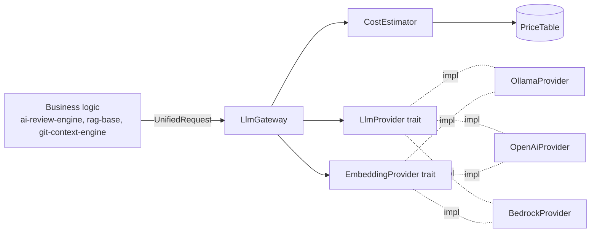

# ai-llm-service — Universal LLM Gateway

> **Status:** STABLE · **Crate:** [`ai-llm-service/`](../../ai-llm-service/) ·
> **Layer:** L1 — AI Gateway

The single point of contact between business logic and any LLM/embedding
provider. Hides provider-specific JSON, headers, signing, and quirks behind
two traits and one façade.

## Purpose

- **One API for many providers.** Callers speak `UnifiedRequest` /
  `UnifiedResponse` and pick a `ModelTier`. The gateway dispatches to the
  right backend.
- **Built-in cost & token analytics.** Every call records normalised token
  usage and an estimated USD cost.
- **One place to add a new vendor.** Implement two traits, register one
  factory line. Business logic does not change.

## Public API

The crate exposes a small, deliberate surface:

| Item | File | Purpose |
| --- | --- | --- |
| `LlmGateway` | [`gateway.rs`](../../ai-llm-service/src/gateway.rs) | Façade. Built from `GatewayConfig`. |
| `LlmGateway::complete(tier, req)` | [`gateway.rs:130`](../../ai-llm-service/src/gateway.rs#L130) | Routes a chat completion. |
| `LlmGateway::embed_batch(tier, req)` | [`gateway.rs:160`](../../ai-llm-service/src/gateway.rs#L160) | Routes a batch embedding. |
| `LlmGateway::health_all()` | [`gateway.rs:188`](../../ai-llm-service/src/gateway.rs#L188) | Probes every configured provider. |
| `LlmProvider` trait | [`traits.rs`](../../ai-llm-service/src/traits.rs) | Implement to add a chat backend. |
| `EmbeddingProvider` trait | [`traits.rs`](../../ai-llm-service/src/traits.rs) | Implement to add an embedding backend. |
| `UnifiedRequest`, `UnifiedResponse`, `UnifiedMessage`, `Role` | [`unified.rs`](../../ai-llm-service/src/unified.rs) | Provider-agnostic schema. |
| `EmbeddingRequest`, `EmbeddingResponse` | [`unified.rs`](../../ai-llm-service/src/unified.rs) | Batch embedding schema. |
| `TokenUsage`, `CostEstimate` | [`unified.rs`](../../ai-llm-service/src/unified.rs) | Normalised analytics. |
| `ModelTier`, `EmbeddingTier` | [`gateway.rs`](../../ai-llm-service/src/gateway.rs) | Routing keys. |
| `ProviderConfig`, `ProviderKind` | [`config/`](../../ai-llm-service/src/config/) | Per-provider configuration. |
| `GatewayConfig` | [`config/mod.rs`](../../ai-llm-service/src/config/mod.rs) | Top-level typed env tree. |
| `init_tracing(&LogConfig)` | [`telemetry.rs`](../../ai-llm-service/src/telemetry.rs) | Pretty stdout + JSON daily-rotated file. |
| `LlmGateway::usage_snapshot()` | [`gateway.rs`](../../ai-llm-service/src/gateway.rs) | Cumulative counters: calls, tokens, cost, breakdown. |
| `UsageRecorder`, `UsageRecord`, `UsageSnapshot` | [`usage.rs`](../../ai-llm-service/src/usage.rs) | Per-call audit trail. |
| `GatewayError` | [`errors.rs`](../../ai-llm-service/src/errors.rs) | Top-level error. |

Full schema reference: [reference/unified-schema](../reference/unified-schema.md).

## Architecture



The gateway holds two `HashMap`s keyed by tier; each value is an
`Arc<dyn LlmProvider>` or `Arc<dyn EmbeddingProvider>`. There is no
provider-specific type in the gateway internals.

## Configuration

All provider configuration is loaded once via `GatewayConfig::from_env()`.
For the full env-var matrix see [guides/configuration](../guides/configuration.md).

The minimum to run with Ollama only:

```env
LLM_FAST_PROVIDER=ollama
LLM_FAST_MODEL=llama3
LLM_SMART_PROVIDER=ollama
LLM_SMART_MODEL=llama3
LLM_EMBED_PROVIDER=ollama
LLM_EMBED_MODEL=bge-m3
OLLAMA_URL=http://localhost:11434
LLM_PRICING_PATH=pricing.toml
```

Mixing providers per tier is supported — e.g., Bedrock smart tier with
Ollama embeddings. See [guides/configuration](../guides/configuration.md)
for the Bedrock and OpenAI matrices.

## Usage example

```rust
use std::sync::Arc;
use ai_llm_service::{
    GatewayConfig, LlmGateway, ModelTier, UnifiedRequest, UnifiedMessage, init_tracing,
};

#[tokio::main]
async fn main() -> Result<(), Box<dyn std::error::Error>> {
    dotenvy::dotenv()?;

    let cfg = GatewayConfig::from_env()?;
    let _log_guard = init_tracing(&cfg.log)?;

    let gateway = Arc::new(LlmGateway::from_config(cfg)?);

    // Health snapshot of all configured providers.
    for s in gateway.health_all().await {
        tracing::info!(?s.role, %s.provider, ok = s.ok, "{}", s.message);
    }

    // Smart-tier completion.
    let req = UnifiedRequest {
        messages: vec![
            UnifiedMessage::system("You are a senior reviewer."),
            UnifiedMessage::user("Summarise the contract of `LlmProvider`."),
        ],
        ..UnifiedRequest::user_only("")
    };
    let resp = gateway.complete(ModelTier::Smart, req).await?;
    println!("answer = {}", resp.content);
    println!("cost   = ${:.6}", resp.cost.usd);

    Ok(())
}
```

## Internal structure

```
ai-llm-service/src/
├── lib.rs                  # re-exports the public surface
├── gateway.rs              # LlmGateway, ModelTier, EmbeddingTier
├── traits.rs               # LlmProvider, EmbeddingProvider, HealthInfo
├── unified.rs              # UnifiedRequest/Response/Message/Role/TokenUsage
├── analytics.rs            # CostEstimator
├── usage.rs                # UsageRecorder, JsonlUsageRecorder, UsageCounters, UsageSnapshot
├── health.rs               # HealthSnapshot, HealthRole
├── errors.rs               # GatewayError + variants
├── telemetry.rs            # init_tracing (stdout + JSON file rotation)
├── sigv4.rs                # AWS SigV4 signer (used by BedrockProvider)
├── config/
│   ├── mod.rs              # GatewayConfig::from_env()
│   ├── provider_config.rs  # ProviderConfig (with extras HashMap)
│   ├── provider_kind.rs    # ProviderKind enum
│   ├── pricing.rs          # PriceTable, ModelPrice
│   └── log.rs              # LogConfig
└── providers/
    ├── mod.rs
    ├── ollama.rs           # OllamaProvider — /api/chat, /api/embeddings
    ├── openai.rs           # OpenAiProvider — /v1/chat/completions, /v1/embeddings
    └── bedrock.rs          # BedrockProvider — Converse + Titan v2 via SigV4
```

### How a request flows internally

1. Caller invokes `gateway.complete(ModelTier::Fast, req)`.
2. Gateway looks up `Arc<dyn LlmProvider>` for that tier.
3. Provider serialises `UnifiedRequest` into its native JSON, signs / authenticates as needed, POSTs.
4. Provider parses the response, populating `TokenUsage` from native fields.
5. Gateway applies `CostEstimator` to fill `CostEstimate`.
6. Gateway emits a single structured `info!` line and returns the response.

## Errors

The crate uses a single top-level `GatewayError`; provider-level details are
wrapped in `ProviderError`.

| Variant | When |
| --- | --- |
| `GatewayError::Config(_)` | Bad/missing env, invalid endpoint at startup. |
| `GatewayError::Health(_)` | Health probe failure. |
| `GatewayError::Provider(_)` | Provider HTTP error, decode error, missing key. |
| `GatewayError::Pricing(_)` | `pricing.toml` unreadable or invalid. |
| `GatewayError::UnsupportedTier(_)` | Caller asked for a tier not present. |
| `GatewayError::ProviderNotConfigured(_)` | Tier configured but provider could not be instantiated. |
| `GatewayError::HttpTransport(_)` | Reqwest-level network error. |
| `GatewayError::Timeout(_)` | Provider exceeded `timeout_secs`. |

Full table: [reference/errors](../reference/errors.md).

## Testing

`cargo test -p ai-llm-service` — 32 tests, all hermetic:

| File | Coverage |
| --- | --- |
| `tests/ollama_provider.rs` | wiremock: `/api/chat`, `/api/embeddings`, 4xx/5xx, empty content, invalid endpoint. |
| `tests/openai_provider.rs` | wiremock: `/v1/chat/completions`, `/v1/embeddings`, Bearer auth, index reordering, 429, missing key. |
| `tests/bedrock_provider.rs` | wiremock: Converse system/messages split, 403 propagation, Titan loop+token aggregation, missing region/secret. |
| `tests/gateway.rs` | hand-rolled `MockLlm`/`MockEmbed`: routing, cost attachment, error propagation. |
| `tests/cost.rs` | `CostEstimator` math against `pricing.toml` fixtures. |
| `src/sigv4.rs` (mod tests) | Authorization shape, determinism, body sensitivity, session-token signed-headers. |

## Related docs

- [Architecture Overview](../architecture/overview.md)
- [Add a new LLM Provider](../guides/add-llm-provider.md)
- [Unified Schema](../reference/unified-schema.md)
- [Pricing](../reference/pricing.md)
- [Usage Log](../reference/usage-log.md)
- [Errors](../reference/errors.md)
- [Observability](../guides/observability.md)
