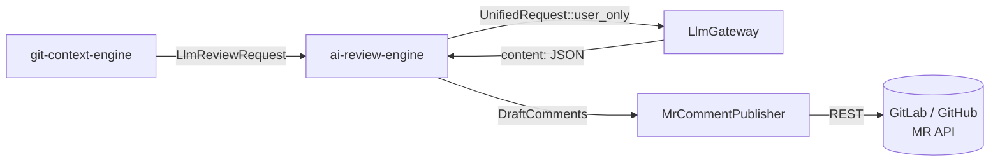

# ai-review-engine — MR Review Engine

> **Status:** STABLE · **Crate:** [`ai-review-engine/`](../../ai-review-engine/) ·
> **Layer:** L3 — Orchestration

Generates AI review comments for a merge request and publishes them back to
the source Git provider.

## Purpose

- Take an `LlmReviewRequest` produced by `git-context-engine`.
- Run the **fast tier** of the gateway over each diff hunk, expecting JSON.
- Map the AI's anchors onto MR file lines, build `DraftComment`s.
- Publish all drafts in a single batch via `MrCommentPublisher`.

This crate intentionally does **not** know how to fetch MRs or build prompts
— it only consumes a fully-shaped request and orchestrates the AI loop and
publishing step.

## Public API

| Item | File | Purpose |
| --- | --- | --- |
| `review_merge_request(req, gateway, cfg)` | [`src/lib.rs:87`](../../ai-review-engine/src/lib.rs#L87) | Top-level entry point. |
| `publish_review_comments(cfg, ctx, drafts)` | [`src/lib.rs:191`](../../ai-review-engine/src/lib.rs#L191) | Bulk-publish helper. |
| `AiReviewEngineError` | [`src/error_handler.rs`](../../ai-review-engine/src/error_handler.rs) | Crate-level error. |
| `MrCommentPublisher`, `DraftComment`, `ProviderConfig` | [`src/publish/`](../../ai-review-engine/src/publish/) | Comment publishing toolkit. |

## Architecture



The engine only depends on `ai-llm-service` (for the gateway) and
`git-context-engine` (for the request shape).

## Configuration

No env-vars of its own. Receives:

- `Arc<LlmGateway>` from the application root.
- `&ProviderConfig` describing how to talk to the Git provider (token, base
  URL).

## Usage example

```rust
use std::sync::Arc;
use ai_llm_service::LlmGateway;
use ai_review_engine::{review_merge_request, publish::ProviderConfig};
use ai_review_engine::publish::GitProviderKind;

async fn run_review(
    gateway: Arc<LlmGateway>,
    review_request: git_context_engine::prompt::LlmReviewRequest,
) -> Result<(), Box<dyn std::error::Error>> {
    let cfg = ProviderConfig {
        kind: GitProviderKind::GitLab,
        base_url: std::env::var("GIT_API_BASE")?,
        token: std::env::var("GIT_TOKEN")?,
    };
    review_merge_request(review_request, gateway, &cfg).await?;
    Ok(())
}
```

## Internal structure

```
ai-review-engine/src/
├── lib.rs                  # review_merge_request, publish_review_comments
├── error_handler.rs        # AiReviewEngineError, MrPublishError
└── publish/
    ├── mod.rs              # MrCommentPublisher
    ├── ai_response.rs      # AiFileReview JSON shape, anchor mapper
    ├── github.rs / gitlab.rs / gitbucket.rs   # provider clients
    └── ...
```

### Per-target loop

For each `target` in `review_request.targets`:

1. `gateway.complete(ModelTier::Fast, UnifiedRequest::user_only(target.prompt_text))`.
2. Parse the response `content` as `AiFileReview` JSON. Malformed → log warn,
   skip target (does not abort the whole MR).
3. Map each `AiAnchor` onto the smallest line number found in the anchor's
   diff lines (basic mapper) → produce `DraftComment`s.

Once all hunks are processed, drafts are published in a single
`publisher.publish_all(...)` call.

## Errors

| Variant | When |
| --- | --- |
| `AiReviewEngineError::Ai` | `GatewayError` propagated from `gateway.complete`. |
| `AiReviewEngineError::InvalidRequest` | Up-front validation failure. |
| `AiReviewEngineError::Publish` | Comment publishing failed. |

Reference: [reference/errors](../reference/errors.md).

## Testing

No unit tests in this crate today. Validation happens at the workspace level
via the trigger route smoke run. Adding wiremock-backed integration tests
for the publishing path is a known follow-up.

## Related docs

- [Data Flow — Review an MR](../architecture/data-flow.md#flow-2--review-an-mr)
- [services/ai-llm-service](ai-llm-service.md)
- [services/git-context-engine](git-context-engine.md)
