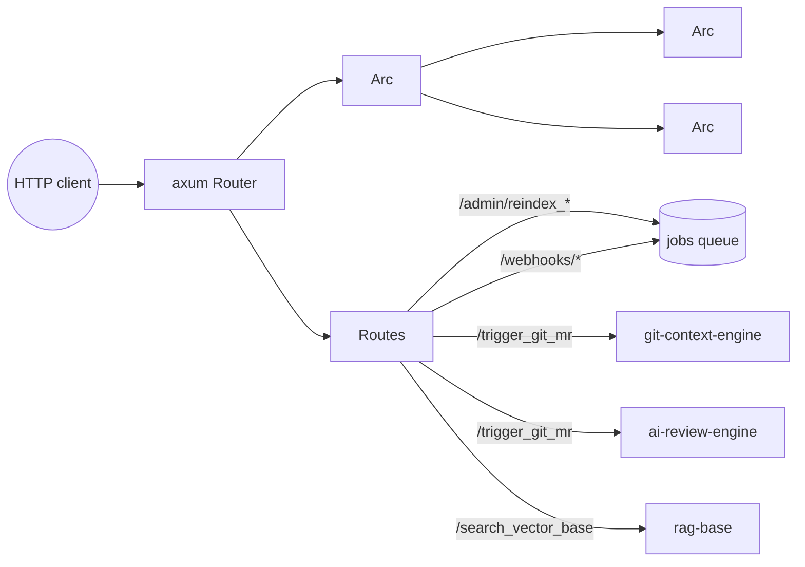

# api — HTTP Server

> **Status:** STABLE · **Crate:** [`api/`](../../api/) ·
> **Layer:** L4 — Transport

Axum-based HTTP front-end. Owns no business logic — every route is a thin
adapter over the lower layers.

## Purpose

- Expose the only externally-reachable surface of the backend.
- Wire `Arc<LlmGateway>` and `Arc<AppConfig>` into shared `AppState`.
- Validate and shape requests / responses (`ApiResponse<T>`, error
  envelope).
- Run graceful shutdown on Ctrl+C.

## Public API

| Item | File | Purpose |
| --- | --- | --- |
| `start(gateway: Arc<LlmGateway>)` | [`src/lib.rs:32`](../../api/src/lib.rs#L32) | Build the router and run the server. |
| `AppState`, `AppConfig` | [`src/core/app_state.rs`](../../api/src/core/app_state.rs) | Shared state. |
| `AppError`, `AppResult` | [`src/error_handler.rs`](../../api/src/error_handler.rs) | Top-level HTTP error. |

## Routes

Routes split into two groups by auth:

- **Operator (require `X-Admin-Token`):** `/admin/*`, `/retrieve`, `/search_vector_base`, `/trigger_git_mr`. The middleware lives at [`middleware_layer::admin_auth`](../../api/src/middleware_layer/admin_auth.rs) and compares the header in constant time against `AppConfig::trigger_secret`.
- **Public:** `/webhooks/*` (own HMAC), `/health/*`, `/usage`.

| Method | Path | Auth | Handler | What it does |
| --- | --- | --- | --- | --- |
| `POST` | `/admin/reindex_repo` | `X-Admin-Token` | [`reindex_repo_route`](../../api/src/routes/admin/reindex_repo_route.rs) | S5 — enqueue a single `Reindex` job by `remote_url`. See [Admin API](../reference/admin-api.md). |
| `POST` | `/admin/reindex_all` | `X-Admin-Token` | [`reindex_all_route`](../../api/src/routes/admin/reindex_all_route.rs) | S5 — fan out one `Reindex` job per repo declared under the default project. Sub-jobs enqueued in a single transaction. |
| `POST` | `/retrieve` | `X-Admin-Token` | [`retrieve_route`](../../api/src/routes/retrieve/retrieve_route.rs) | S8 — vector search + graph expand + optional MR overlay. See [Retrieve API](../reference/retrieve-api.md). |
| `POST` | `/search_vector_base` | `X-Admin-Token` | [`search_vector_base_route`](../../api/src/routes/rag_base/search_vector_base_route.rs) | Semantic search via `rag_base::search_code`. Deprecated by `/retrieve` (S8); kept for back-compat. |
| `POST` | `/trigger_git_mr` | `X-Admin-Token` | [`trigger_mr_route`](../../api/src/routes/check_mr/trigger_mr_route.rs) | End-to-end MR review pipeline. |
| `POST` | `/webhooks/{gitlab,github,bitbucket}` | provider HMAC | [`webhooks/*`](../../api/src/routes/webhooks) | Inbound push / MR webhooks. |
| `GET` | `/health/{live,ready,detailed}` | none | [`health/*`](../../api/src/routes/health) | Liveness / readiness probes. |
| `GET` | `/health/dashboard` | none | [`health/dashboard`](../../api/src/routes/health/dashboard.rs) | Cached ops aggregate (jobs by state, MR reviews, LLM usage, worker pool). Refreshed every `DASHBOARD_REFRESH_SECS` (default 30s). 503 when persistence is disabled. |
| `GET` | `/metrics` | none | [`metrics/metrics_route`](../../api/src/routes/metrics/metrics_route.rs) | Prometheus text exposition. Open route — network-level isolation expected (see observability service page). |
| `GET` | `/usage` | none | [`usage_route`](../../api/src/routes/usage/usage_route.rs) | Live snapshot: total calls, tokens, USD cost, per-(tier,provider,model) breakdown. |
| (any) | `/*` | — | `handler_404` | Fallback. |

### `X-Project-Slug` requirement (sprint C3 of 🅲)

Every admin-router request (`/admin/reindex_repo`,
`/admin/reindex_all`, `/retrieve`, `/trigger_git_mr`) must carry
the `X-Project-Slug: <slug>` header. The middleware resolves slug
→ `ProjectId` and threads an `AuthorizedScope` into request
extensions for downstream handlers (Sprint C4 starts consuming it).

```bash
curl -X POST :8080/retrieve \
  -H "X-Admin-Token: $TRIGGER_SECRET" \
  -H "X-Project-Slug: acme" \
  -H "Content-Type: application/json" \
  -d '{"query":"auth middleware","top_k":5}'
```

| Failure | Status | Code |
|---|---|---|
| Header absent | 400 | `MISSING_PROJECT_SLUG` |
| Slug unknown | 400 | `UNKNOWN_PROJECT` |
| Persistence disabled | 503 | `PERSISTENCE_DISABLED` |

`admin_auth` runs before `extract_tenant` — missing both headers
sees 401 first.

Webhooks, `/health/*`, `/metrics`, `/usage` do **not** require the
header.

### `/retrieve` LLM rerank (sprint 4a)

When the request body sets `"rerank": true`, the handler runs a
Smart-tier LLM rerank over the merged vector + graph + overlay hit
set before returning. The reordered hits replace the natural score
ordering; each hit's `score` field carries the LLM's [0.0, 1.0]
rescaled value.

```json
{
  "query": "auth middleware",
  "top_k": 5,
  "rerank": true,
  "rerank_top_k": 5
}
```

| Field | Default | Effect |
|---|---|---|
| `rerank` | `false` | Opt-in per call. Off → legacy path, no LLM cost. |
| `rerank_top_k` | `top_k` | Cap on the post-rerank result count. Up to `rerank_top_k * 3` candidates are sent to the LLM. |

Caching: `(query, project_id, repo_id, rerank_top_k, sorted chunk_ids)` is hashed to a `cache_key` and persisted in
[`rerank_cache`](persistence.md#rerank-cache-sprint-4a). Default TTL
1h (`RERANK_CACHE_TTL_HOURS`). A hit returns instantly without an LLM
call. Cleanup task in `api::start` prunes expired rows.

Knobs:
- `RAG_RERANK_TIMEOUT_SECS` (default 20) — hard timeout on the rerank
  LLM call; failure transparently falls back to heuristic rerank.
- `RERANK_CACHE_TTL_HOURS` (default 1).
- `RERANK_CACHE_CLEANUP_INTERVAL_SECS` (default 86400).

### `/health/dashboard` response shape

```json
{
  "as_of": "2026-05-12T10:00:30Z",
  "jobs": {
    "queued":  {"Reindex": 5, "IngestMr": 2},
    "running": {"Reindex": 1, "IngestMr": 1},
    "dead":    {"IngestMr": 3},
    "done":    {},
    "failed":  {}
  },
  "mr_reviews": {
    "by_status": {"pending": 1, "published": 142, "failed": 7}
  },
  "llm":    {"total_calls": 234, "total_tokens": 12345, "total_cost_usd": 0.82},
  "worker": {"pool_size": 4}
}
```

First poll right after boot may show `as_of=null` and zero counters
— the monitor refreshes on a fixed interval (default 30s); the first
refresh runs immediately so warm-up is ~one DB round-trip.

## Architecture



## Configuration

| Var | Purpose |
| --- | --- |
| `API_ADDRESS` | Bind address, e.g. `0.0.0.0:8080`. |
| `GIT_API_BASE`, `GIT_TOKEN` | Git provider credentials. Host-scoped overrides documented in [Configuration → Per-host overrides](../guides/configuration.md). |
| `TRIGGER_SECRET` | Shared secret matched against `X-Admin-Token` for every operator route (`/admin/*`, `/retrieve`, `/search_vector_base`, `/trigger_git_mr`). |
| `PROJECTS_CONFIG` | Path to `projects.toml`; **must declare exactly one `[[project]]`** (S5 single-project invariant). |

Plus all `LLM_*`, `RAG_*`, `QDRANT_*` vars consumed by the layers below.
See [Configuration](../guides/configuration.md).

## Usage example

```bash
# .env loaded from workspace root
cargo run --release
# → server listens on $API_ADDRESS

curl -X POST http://localhost:8080/trigger_git_mr \
  -H 'content-type: application/json' \
  -d '{"project_id":"team/repo","mr_iid":42,"secret":"$TRIGGER_SECRET"}'
```

## Internal structure

```
api/src/
├── lib.rs                  # start(), router wiring, shutdown
├── error_handler.rs        # AppError + IntoResponse
├── core/
│   ├── app_state.rs        # AppConfig, AppState
│   └── http/               # ApiResponse<T> envelope, ApiErrorDetail
├── middleware_layer/
│   └── json_extractor.rs   # JSON parse error mapper
└── routes/
    ├── check_mr/
    ├── project_indexer/
    ├── rag_base/
    └── sync_git/
```

## Errors

`AppError` implements `IntoResponse`. Every route returns a uniform
`ApiResponse<T>` JSON envelope: `{ status, data | error: { code, message,
details } }`.

## Testing

Smoke testing via curl against a running stack. No automated HTTP tests
yet.

## Related docs

- [Architecture Overview](../architecture/overview.md)
- [Data Flow](../architecture/data-flow.md)
- [services/ai-llm-service](ai-llm-service.md)
