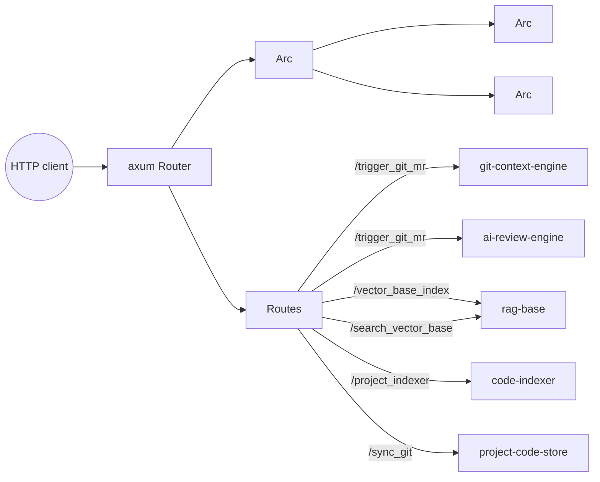

# api — HTTP Server

> **Status:** STABLE · **Crate:** [`api/`](../../api/) ·
> **Layer:** L4 — Transport

Axum-based HTTP front-end. Owns no business logic — every route is a thin
adapter over the lower layers.

## Purpose

- Expose the only externally-reachable surface of the backend.
- Wire `Arc<LlmGateway>` and `Arc<AppConfig>` into shared `AppState`.
- Validate and shape requests / responses (`ApiResponse<T>`, error
  envelope).
- Run graceful shutdown on Ctrl+C.

## Public API

| Item | File | Purpose |
| --- | --- | --- |
| `start(gateway: Arc<LlmGateway>)` | [`src/lib.rs:32`](../../api/src/lib.rs#L32) | Build the router and run the server. |
| `AppState`, `AppConfig` | [`src/core/app_state.rs`](../../api/src/core/app_state.rs) | Shared state. |
| `AppError`, `AppResult` | [`src/error_handler.rs`](../../api/src/error_handler.rs) | Top-level HTTP error. |

## Routes

| Method | Path | Handler | What it does |
| --- | --- | --- | --- |
| `POST` | `/sync_git` | [`sync_git_route`](../../api/src/routes/sync_git/sync_git_route.rs) | Clones / updates configured repos via `project-code-store`. |
| `GET` | `/project_indexer` | [`project_indexer_route`](../../api/src/routes/project_indexer/project_indexer_route.rs) | Runs `code-indexer` over the local checkout. |
| `GET` | `/vector_base_index` | [`vector_base_index_route`](../../api/src/routes/rag_base/vector_base_index_route.rs) | Triggers `rag_base::load_fresh_index` against Qdrant. |
| `POST` | `/search_vector_base` | [`search_vector_base_route`](../../api/src/routes/rag_base/search_vector_base_route.rs) | Semantic search via `rag_base::search_code`. |
| `POST` | `/trigger_git_mr` | [`trigger_mr_route`](../../api/src/routes/check_mr/trigger_mr_route.rs) | End-to-end MR review pipeline. |
| (any) | `/*` | `handler_404` | Fallback. |

## Architecture



## Configuration

| Var | Purpose |
| --- | --- |
| `API_ADDRESS` | Bind address, e.g. `0.0.0.0:8080`. |
| `PROJECT_NAME` | Logical project key, used by all downstream layers. |
| `GIT_API_BASE`, `GIT_TOKEN` | Git provider credentials. |
| `TRIGGER_SECRET` | Shared secret guarding `/trigger_git_mr`. |

Plus all `LLM_*`, `RAG_*`, `QDRANT_*` vars consumed by the layers below.
See [Configuration](../guides/configuration.md).

## Usage example

```bash
# .env loaded from workspace root
cargo run --release
# → server listens on $API_ADDRESS

curl -X POST http://localhost:8080/trigger_git_mr \
  -H 'content-type: application/json' \
  -d '{"project_id":"team/repo","mr_iid":42,"secret":"$TRIGGER_SECRET"}'
```

## Internal structure

```
api/src/
├── lib.rs                  # start(), router wiring, shutdown
├── error_handler.rs        # AppError + IntoResponse
├── core/
│   ├── app_state.rs        # AppConfig, AppState
│   └── http/               # ApiResponse<T> envelope, ApiErrorDetail
├── middleware_layer/
│   └── json_extractor.rs   # JSON parse error mapper
└── routes/
    ├── check_mr/
    ├── project_indexer/
    ├── rag_base/
    └── sync_git/
```

## Errors

`AppError` implements `IntoResponse`. Every route returns a uniform
`ApiResponse<T>` JSON envelope: `{ status, data | error: { code, message,
details } }`.

## Testing

Smoke testing via curl against a running stack. No automated HTTP tests
yet.

## Related docs

- [Architecture Overview](../architecture/overview.md)
- [Data Flow](../architecture/data-flow.md)
- [services/ai-llm-service](ai-llm-service.md)
