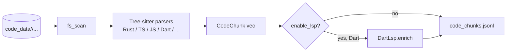

# code-indexer — AST / LSP Indexer

> **Status:** STABLE · **Crate:** [`code-indexer/`](../../code-indexer/) ·
> **Layer:** L2 — Capabilities

Walks a checked-out repository, parses each supported source file with
Tree-sitter, and emits compact `CodeChunk`s as JSONL. Optionally enriches
Dart files with LSP signatures.

## Purpose

- Provide a uniform on-disk representation of a project's code that
  `rag-base` can stream and embed — independent of the original VCS, build
  system, and language tooling.
- Be the only place where AST parsing happens. Other crates consume the
  JSONL output, never the raw source tree.

## Public API

| Item | File | Purpose |
| --- | --- | --- |
| `index_project_to_jsonl(project_name, enable_lsp)` | [`src/lib.rs`](../../code-indexer/src/lib.rs) | Walks `code_data/<project>/`, writes `code_chunks.jsonl`. |
| `index_diff_model(model, enable_lsp)` | [`src/lib.rs`](../../code-indexer/src/lib.rs) | Index only files referenced by a diff model (used by `git-context-engine`). |
| `CodeChunk`, `LanguageKind` | [`src/types.rs`](../../code-indexer/src/types.rs) | Output schema. |
| `DiffAstModel` | [`src/diff_types.rs`](../../code-indexer/src/diff_types.rs) | Input shape for diff-scoped indexing. |
| `Error`, `Result` | [`src/errors.rs`](../../code-indexer/src/errors.rs) | Crate error type. |

## Architecture



The crate is a leaf — it has no upstream dependencies on other workspace
crates and is consumed by `rag-base` (via JSONL on disk) and
`git-context-engine` (via `DiffAstModel`).

## Configuration

No env-vars of its own. Output path is derived from `project_name`:

```
code_data/out/<project_name>/code_chunks.jsonl
```

## Usage example

```rust
use code_indexer::index_project_to_jsonl;

let path = index_project_to_jsonl("team-repo", false)?;
println!("wrote {}", path.display());
```

## Internal structure

```
code-indexer/src/
├── lib.rs              # index_project_to_jsonl, index_diff_model
├── types.rs            # CodeChunk, ChunkKind, LanguageKind
├── diff_types.rs       # DiffAstModel
├── errors.rs           # Error, Result
├── ast/                # Tree-sitter routers per language
│   ├── router.rs
│   └── dart/
│       ├── extract.rs      # flat symbol-level emission
│       └── hierarchy.rs    # S3 — file / parent / symbol / sub decoration
├── lsp/                # LSP enrichment hooks (Dart implemented, others stubbed)
│   ├── interface.rs
│   ├── dart.rs
│   └── stub.rs
└── util/
    └── fs_scan.rs      # recursive file walker with extension filters
```

## Emission strategy (S3 + S4A)

| Language | Status | Chunk levels |
| --- | --- | --- |
| Dart | shipped (S3) | file / parent / symbol / sub |
| Rust | shipped (S4A) | file / parent / symbol / sub |
| TypeScript | S4B | placeholder — currently text-fallback |

See [Chunking](chunking.md) for the contract and `parent_symbol_id`
linking model. The decorator
(`ast::hierarchy::decorate_hierarchy`) is language-agnostic and runs
after the per-language extractor — Dart, Rust (S4A), and the upcoming
TypeScript (S4B) all feed it.

| Analyzer | Edge kinds | Implementation |
| --- | --- | --- |
| Dart | imports, defines, calls, inherits, type_uses, async_boundary | [`analyzer::dart`](../../code-indexer/src/analyzer/dart.rs) |
| Rust | imports, defines, calls, inherits, type_uses, async_boundary | [`analyzer::rust`](../../code-indexer/src/analyzer/rust.rs) — see [Rust Analyzer](rust-analyzer.md) |
| TypeScript | _S4B_ | _coming next_ |

## Errors

Documented in [`src/errors.rs`](../../code-indexer/src/errors.rs). Surfaced
to upstream consumers (e.g., `git-context-engine`) as
`GitContextEngineError::CodeIndexer(String)`.

## Testing

The crate has a doctest in [`src/lib.rs`](../../code-indexer/src/lib.rs)
that references a now-renamed binary; treat it as a known-broken pre-existing
issue (tracked separately, not blocking gateway work). Production use is
exercised through the `/vector_base_index` route.

## Related docs

- [services/rag-base](rag-base.md)
- [services/git-context-engine](git-context-engine.md)
