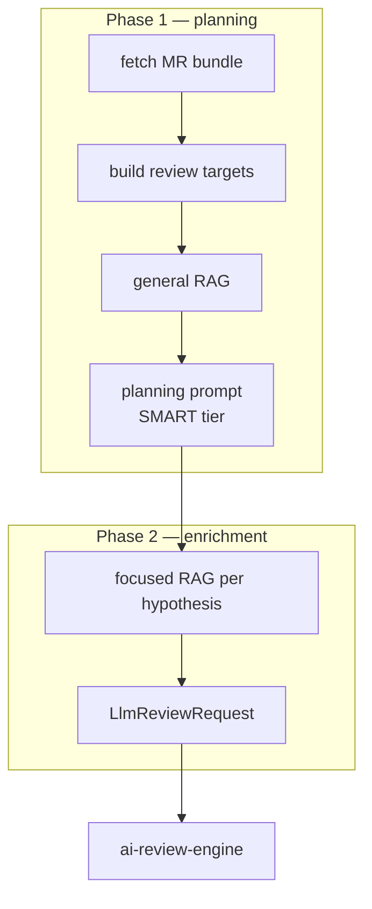

# git-context-engine — MR Context Builder

> **Status:** STABLE · **Crate:** [`git-context-engine/`](../../git-context-engine/) ·
> **Layer:** L3 — Orchestration

Fetches a merge/pull request from a Git provider, builds a structured
`LlmReviewRequest` with diff targets, AST/RAG context, and review rules.
Implements the **two-phase review** strategy (planning then execution).

## Purpose

- Talk to GitLab / GitHub / Gitea APIs to fetch the MR bundle (diff +
  commits + metadata).
- Slice diffs into per-hunk **review targets**.
- Pull semantically related code from `rag-base` for each target.
- (Phase 1) Run a **planning prompt** on the smart tier to produce
  hypotheses and "required context" hints.
- (Phase 2) Re-run RAG focused on those hints to enrich each target.
- Hand off a fully-prepared `LlmReviewRequest` to `ai-review-engine`.

## Public API

| Item | File | Purpose |
| --- | --- | --- |
| `get_ai_request_data(gateway, project, cfg, id)` | [`src/lib.rs:43`](../../git-context-engine/src/lib.rs#L43) | One-shot path: bundle → targets → general RAG → request. |
| `build_two_phase_review(project, cfg, id, gateway, save_logs)` | [`src/lib.rs:116`](../../git-context-engine/src/lib.rs#L116) | Planning + enriched RAG, recommended for production. |
| `LlmReviewRequest` | [`src/prompt/`](../../git-context-engine/src/prompt/) | Output structure consumed by `ai-review-engine`. |
| `ProviderConfig`, `ProviderKind`, `ChangeRequestId` | [`src/git_providers/`](../../git-context-engine/src/git_providers/) | Git provider configuration. |
| `GitContextEngineError`, `GitContextEngineResult` | [`src/errors.rs`](../../git-context-engine/src/errors.rs) | Error types. |

## Architecture



## Configuration

Reads only Git provider settings (token, base URL) from `ProviderConfig`,
which is built by the caller from `.env`. AI configuration is supplied via
the `Arc<LlmGateway>` passed in.

Used env vars (consumed by callers, not this crate directly):
- `GIT_API_BASE`, `GIT_TOKEN` — Git provider credentials.
- `PROJECT_NAME` — used as RAG collection key.

## Usage example

```rust
use std::sync::Arc;
use ai_llm_service::LlmGateway;
use git_context_engine::{
    build_two_phase_review,
    git_providers::{ChangeRequestId, ProviderConfig, ProviderKind},
};

async fn run(
    gateway: Arc<LlmGateway>,
    project_name: &str,
) -> Result<(), Box<dyn std::error::Error>> {
    let cfg = ProviderConfig {
        kind: ProviderKind::GitLab,
        base_api: std::env::var("GIT_API_BASE")?,
        token: std::env::var("GIT_TOKEN")?,
    };
    let id = ChangeRequestId { project: "team/repo".into(), iid: 42 };

    let request = build_two_phase_review(project_name, cfg, id, gateway, false).await?;
    println!("targets prepared: {}", request.targets.len());
    Ok(())
}
```

## Internal structure

```
git-context-engine/src/
├── lib.rs                  # get_ai_request_data, build_two_phase_review
├── errors.rs               # GitContextEngineError + From<GatewayError>
├── git_providers/          # GitLab/GitHub/Bitbucket REST clients
├── diff_model.rs           # ReviewTarget construction from unified diff
├── ast_context.rs          # NoopAstContextProvider + extension point
├── rag_layer/              # build_rag_contexts_for_targets, build_enriched_rag_contexts
├── pre_review/             # planning prompt + LLM call (smart tier)
├── prompt/
│   ├── builder.rs          # final LlmReviewRequest assembly
│   └── ...
└── rules/                  # built-in & per-language review rules
```

### Two-phase strategy in detail

1. **Bundle fetch.** `ProviderClient::fetch_bundle(&id)` returns commits +
   per-file diffs.
2. **Target derivation.** `build_review_targets(&bundle.changes)` converts
   each hunk into a `ReviewTarget` with diff preview and metadata.
3. **General RAG.** `build_rag_contexts_for_targets(gateway, project_name,
   &targets, Some(2))` runs a short semantic search per target.
4. **Planning prompt.** `pre_review::run_pre_review_planning(...)` calls
   `gateway.complete(ModelTier::Smart, ...)` with a system message
   instructing the model to identify hypotheses and "required context" —
   not to do the review yet.
5. **Enriched RAG.** `build_enriched_rag_contexts(gateway, project_name,
   &targets, &plan, base_k=5, focus_k=3)` issues additional searches keyed
   by the hypotheses returned in step 4.
6. **Final request build.** `build_llm_review_request(&bundle, &targets,
   &ast_provider, &rules, &enriched_rag, Some(&plan))` produces the
   `LlmReviewRequest` consumed by `ai-review-engine`.

## Errors

| Variant | When |
| --- | --- |
| `Provider(_)` | Git provider HTTP / auth / parse failure. |
| `Cache(_)` | Disk cache I/O / JSON failure. |
| `DiffParse(_)` | Malformed unified diff. |
| `Config(_)` | Missing token, malformed base URL. |
| `Llm(_)` | `GatewayError` flattened into a string. |
| `CodeIndexer(_)` | Forwarded from `code-indexer`. |
| `Validation(_)`, `Internal(_)` | Catch-alls. |

## Testing

No unit tests today. The two-phase pipeline is exercised through the
`/trigger_git_mr` route smoke run.

## Related docs

- [Data Flow — Review an MR](../architecture/data-flow.md#flow-2--review-an-mr)
- [services/ai-review-engine](ai-review-engine.md)
- [services/rag-base](rag-base.md)
- [services/code-indexer](code-indexer.md)
