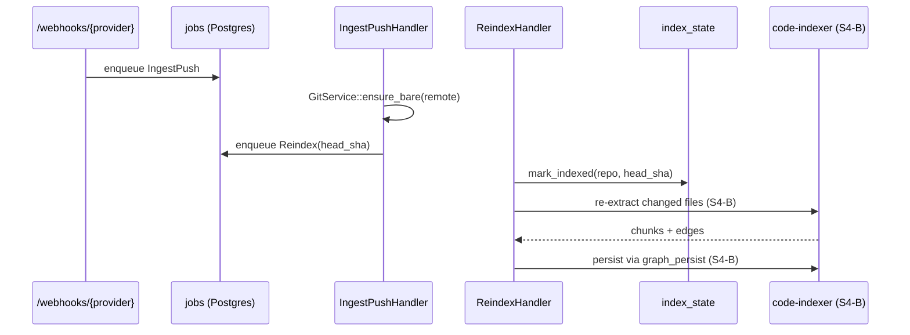

# Graph RAG (part 2 — retrieval pipeline)

`BETA`

S4 splits the review-time read path into a clear three-stage pipeline:

```text
seeds (vector + lexical + overlay)
   └─► graph expansion (k-hop BFS over graph_edges)
          └─► rerank (LLM under token budget) ──► ScoredHit list
```

S4-A ships the **first two stages** as a pure-data plan that worker code
can drive end-to-end. S4-B replaces the heuristic rerank with an LLM
call. The legacy `crate::rag_layer::build_rag_contexts_for_targets` keeps
backing the existing `/trigger_git_mr` path; new code paths build a
[`RetrievalPlan`](../../git-context-engine/src/retrieval/plan.rs).

## Transient overlay

Stable code lives in Qdrant + Postgres. MR-time edits never touch either —
they live in an in-memory [`OverlayGraph`](../../git-context-engine/src/overlay/mod.rs)
built per review:

| Field | Purpose |
| --- | --- |
| `new_chunks` | `CodeChunk`s parsed from the MR worktree. Indexed by `id` for stable lookup. |
| `touched_files` | Repo-relative paths the overlay considers changed. |
| `neighbour_nodes` | Stable `graph_nodes.id`s pulled in via `expand_k_hops` from the touched chunks. Read-only. |

Lifecycle: created at the start of `IngestMr`, dropped on completion. The
stable index is never written to during an MR review.

## Seeds

[`RetrievalSeed`](../../git-context-engine/src/retrieval/plan.rs) records
where a candidate came from:

| `source` | When |
| --- | --- |
| `vector` | Qdrant cosine match against the diff-derived query. |
| `lexical` | BM25 / scroll fallback when vector recall is sparse. |
| `overlay` | Match inside the overlay's `new_chunks` (MR-side hits). |
| `exact` | Symbol-name hit produced by the rules / pre-review planner. |

`RetrievalConfig.top_k` caps the per-target seed count.

## Graph expansion

For every seed cluster, the planner calls
[`graph::expand_k_hops`](../../persistence/src/repos/graph.rs) up to
`RetrievalConfig.max_hops` (default `1`). Edge kinds can be filtered —
typical retrieval uses `Calls`, `TypeUses`, `Imports`. The plan stores the
expanded nodes with their hop distance so the reranker can prefer
seed-adjacent chunks.

## Score floor + token budget

`RetrievalPlan::apply_score_floor` drops seeds below
`RetrievalConfig.min_score`. `RetrievalPlan::enforce_token_budget` trims
the seed list to fit `RetrievalConfig.token_budget`. Both run before
rerank so the reranker never overspends.

## Rerank

Two reranker functions are available. Choose the one that matches your
context budget and SLA:

- [`heuristic_rerank`](../../git-context-engine/src/retrieval/plan.rs) —
  stable-sort by score, break ties by `hops` then `file`. Free, instant,
  good baseline.
- [`llm_rerank`](../../git-context-engine/src/retrieval/llm_rerank.rs)
  (S7) — calls `LlmGateway::complete(Smart, …)` with a JSON-shaped
  prompt asking the model to score each seed in `[0, 1]`. Tolerates
  Markdown code-fence wrapping and prose preambles. **Falls back to the
  heuristic on any failure** (timeout, gateway error, malformed JSON,
  no items returned), so the pipeline always produces hits.

Prompt outline:

```text
You are reranking code retrieval candidates for a code review.
Return STRICTLY a JSON object of the form:
{"items":[{"chunk_id":"<id>","score":<float in [0,1]>},…]}
Only include the chunk_ids supplied below; do not invent new ones.

QUERY:
<diff hunk / target description>

SEEDS:
- chunk_id: <id>; file: <path>; symbol: <symbol_path>; source: <Vector|...>; current_score: <f>
…
```

Both reranker boundaries are free functions, not traits — swapping is a
one-line change at the call site.

## Configuration

| Var | Default | Purpose |
| --- | --- | --- |
| `RAG_TOP_K` | `8` | Seeds per review target. |
| `RAG_MAX_HOPS` | `1` | Maximum graph expansion depth. |
| `RAG_TOKEN_BUDGET` | `8000` | Char ceiling handed to the reranker. |
| `RAG_MIN_SCORE` | `0.0` | Score floor for kept seeds. |

Per-project overrides land in S5 alongside the project-aware credential
routing (same `projects.toml` extension point).

## Incremental delta updater

`IngestPush` pushes flow into [`ReindexHandler`](../../worker/src/handlers.rs).
S4-A advances `index_state.last_indexed_sha` so the upcoming chunk/edge
delta writeback (S4-B) can compute `last_indexed_sha → HEAD` and re-index
only the changed files. The watermark is written even when no chunks
changed, which keeps observability simple.



## Transient overlay (S7)

When the retrieval call carries an `mr_iid`, an in-memory
[`OverlayGraph`](overlay.md) is built lazily via
`overlay::build::build_for_mr`. The builder walks `project_dependencies`
in both directions starting from the primary repo, capped by
`MR_FANOUT_MAX_HOPS` / `MR_FANOUT_MAX_REPOS` / `MR_FANOUT_MAX_CHUNKS`, and
folds the new / changed chunks into the overlay. Worktrees are created
per visit and bulk-dropped at the end of the call.

The overlay never touches Qdrant or Postgres — retrieval merges its
chunks with the stable search hits at rerank time. See
[Overlay Builder](overlay.md) for the contract.

## Hierarchical chunking

`CodeChunk` carries two metadata fields (`parent_symbol_id`, `chunk_kind`).
Both ship with `#[serde(default)]` so legacy JSONL files still load.
The Dart extractor emits all four levels as of S3 — see
[Chunking](chunking.md) for the contract.

| `chunk_kind` | Body | Use |
| --- | --- | --- |
| `file` | Imports + skeleton summary. | High-recall first-pass match. |
| `parent` | Class/mixin/extension/enum + its members. | Anchor for "what does this class do". |
| `symbol` | Method/field/function/constructor. | Fine-grained match. |
| `sub` | Sub-slice of a long body, with `parent_symbol_id` pointing at its symbol parent. | Long-function support without losing parent context. |

The retrieval API consumes the metadata via
[`domain::retrieval::ChunkKind`](../../domain/src/retrieval.rs);
Rust + TypeScript emitters land in S4.

## Related docs

- [Graph layer (part 1)](graph-rag.md)
- [Job queue](../reference/job-queue.md)
- [Database schema](../reference/database-schema.md)
- [Configuration](../guides/configuration.md)
