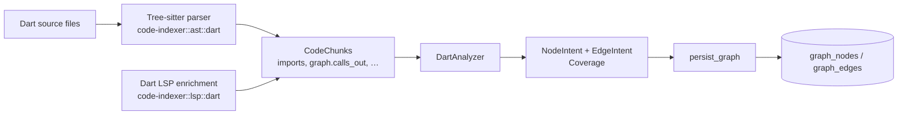

# Graph RAG (part 1 — graph layer)

`BETA`

S3 lays down the graph foundation that S4's hybrid retrieval will sit on
top of. The graph captures structural relationships between code symbols
that pure vector search misses: who calls whom, who inherits from whom,
which file imports which package, etc. It lives in Postgres alongside
project metadata.

This page documents the **graph layer**. The retrieval pipeline (vector +
lexical seed → 1-hop graph expansion → LLM rerank) ships in
[graph-rag (part 2)](#) once S4 lands.

## Schema

Two tables (see [Database schema](../reference/database-schema.md)):

- `graph_nodes(id, repo_id, fqn, kind, file, symbol, language,
  content_sha256, span_start, span_end, …)` — addressable code entities,
  unique per `(repo_id, fqn)`.
- `graph_edges(id, from_node, to_node, edge_type, weight, meta)` —
  directed relationships, unique per `(from, to, edge_type)`.

Both tables cascade on repo delete — re-indexing a repo cleanly drops its
graph.

## Edge taxonomy

| `edge_type` | Semantics | Coverage in S3 |
| --- | --- | --- |
| `imports` | File → import label (package or module). | Dart ✅ |
| `defines` | File → symbol; class → method/field. | Dart ✅ |
| `calls` | Method → callee. | Dart (string-based, from chunk graph payload) |
| `inherits` | Class → super / mixin / interface. | Dart ✅ (extends/with/implements via extras) |
| `type_uses` | Symbol → type used in signature/body. | Dart ✅ |
| `package_dep` | Package → package declared in pubspec/Cargo/package.json. | Reserved — wired in S4 alongside auto-deps. |
| `data_flow` | Variable definition → use site. | Reserved — Dart Analyzer sidecar. |
| `control_flow` | Statement → next statement / branch target. | Reserved — Dart Analyzer sidecar. |
| `async_boundary` | Method → awaited callee marker. | Dart ✅ (LSP-tag heuristic) |
| `Custom(…)` | Domain-specific (Flutter routes, annotations). | Open extension point. |

The string forms above are exactly what `EdgeKind::as_str()` emits and what
lands in `graph_edges.edge_type`. Round-tripping is covered by a unit test
in [`domain/src/graph.rs`](../../domain/src/graph.rs).

## LanguageAnalyzer trait

[`code_indexer::analyzer::LanguageAnalyzer`](../../code-indexer/src/analyzer/mod.rs)
is the extension point. Each implementation reads a slice of `CodeChunk`
records and returns `(NodeIntent, EdgeIntent, Coverage)`.

```rust
pub trait LanguageAnalyzer: Send + Sync {
    fn name(&self) -> &'static str;
    fn supported_languages(&self) -> &'static [&'static str];
    fn analyze_chunks(&self, chunks: &[CodeChunk]) -> AnalysisOutcome;
}
```

The output is intentionally pure data — no DB, no IO. The
[`persistence::graph_persist::persist_graph`](../../persistence/src/graph_persist.rs)
helper translates the intents into surrogate UUIDs and runs the upsert.

### Dart-first analyzer

S3 ships [`DartAnalyzer`](../../code-indexer/src/analyzer/dart.rs), a
zero-state implementation that lifts the existing tree-sitter + Dart LSP
output into the graph model:



#### Coverage today

- `imports` from `CodeChunk.imports` (deduped per file).
- `defines` from file → symbol and parent → symbol via `symbol_path`.
- `calls`, `type_uses` from `CodeChunk.graph.calls_out` /
  `CodeChunk.graph.uses_types`.
- `inherits` from `CodeChunk.extras["dart.extends" | "dart.with" |
  "dart.implements"]`.
- `async_boundary` when `lsp.tags` contains `async` / `future`.

#### Reserved for the sidecar

- `data_flow`, `control_flow`, finer-grained `async_boundary` —
  `package:analyzer` exposes these via the Dart Analysis Server's element
  model and AST visitors. The Rust side will spawn a small Dart binary
  that exposes JSON-RPC over stdio. Tracked in
  [Dart Analyzer sidecar](../guides/dart-analyzer-sidecar.md).

## Persisting the graph

`persist_graph(pool, repo_id, &nodes, &edges)`:

1. Upserts every `NodeUpsert`, remembering the resulting `NodeId` keyed by
   `fqn`.
2. For every `EdgeUpsert`, ensures both endpoints exist — if the analyzer
   only declared one side, the other becomes a placeholder (`kind =
   Custom("placeholder")`). The graph stays referentially consistent;
   subsequent indexing runs upgrade placeholders to real nodes when the
   source becomes available.
3. Upserts edges keyed by `(from, to, edge_type)`.

Returned counters tell you how many real nodes vs placeholders the call
created — useful in `tracing` spans and in S4's diagnostics.

## Querying the graph

Three first-class read paths in
[`persistence::repos::graph`](../../persistence/src/repos/graph.rs):

```rust
graph::neighbours(pool, node_id, Some(&EdgeKind::Calls)).await?;
graph::expand_k_hops(pool, &seeds, /*max_hops=*/2, &[EdgeKind::Calls, EdgeKind::TypeUses]).await?;
graph::edge_counts_by_type(pool).await?;
```

`expand_k_hops` is what S4's retrieval pipeline plugs into after the
embedding/lexical seed step.

## Operational notes

- All node writes are idempotent w.r.t. `(repo_id, fqn)`. Re-indexing the
  same content is safe and cheap.
- Indexes (`graph_nodes_repo_kind_idx`, `graph_edges_from_idx`,
  `graph_edges_type_idx`, …) are sized for the typical
  Flutter-monorepo workload (~10⁵ nodes, ~10⁶ edges).
- Drop-and-recreate for a single repo: `graph::purge_repo(pool, repo)` —
  used by the upcoming admin `/reindex_full` route.

## Related docs

- [Database schema](../reference/database-schema.md)
- [Dart Analyzer sidecar](../guides/dart-analyzer-sidecar.md)
- [code-indexer service](code-indexer.md)
