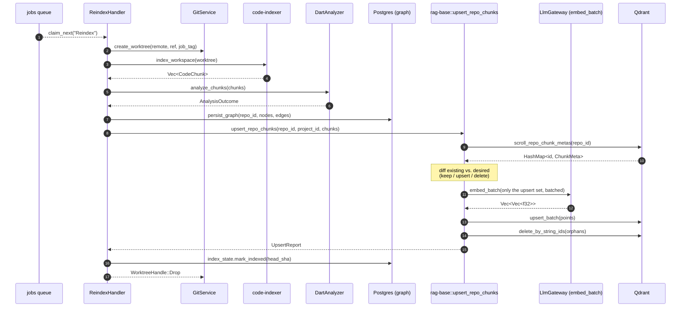

# Ingestion Pipeline — Master Flow

> **Status:** ACTIVE (S2 — Dart only · embedding pipeline wired)
> **Source of truth:** `worker::handlers::ReindexHandler` ·
> `rag_base::upsert_repo_chunks`

A `Reindex` job is the only path that writes vectors into Qdrant on the
master flow. Every Git push first lands an `IngestPush` job that refreshes
the bare clone and enqueues a follow-up `Reindex`; the heavy lifting lives
in `ReindexHandler`.

## Sequence



## Deterministic chunk identity

Point IDs are computed by
[`domain::chunk_id::derive_chunk_id`](../../domain/src/chunk_id.rs):

```text
<repo_uuid>:<file>:<symbol_path>:<sha256[..16]>
```

Stability is what makes the diff cheap — re-running the indexer over an
unchanged worktree produces byte-identical IDs, so `scroll_repo_chunk_metas`
matches them against existing points without re-embedding.

The payload `id` field carries the rich string; the Qdrant numeric
`point_id` is `blake3(id) → u64`, hidden behind `upsert_batch` and
`delete_by_string_ids` so callers never juggle two id spaces.

## Content-sha diff

`upsert_repo_chunks` (see [`rag-base/src/ingest.rs`](../../rag-base/src/ingest.rs))
does three classifications per chunk:

| Classification | Condition | Action |
| --- | --- | --- |
| **keep** | id present in Qdrant **and** `content_sha256` matches | no embed, no upsert. |
| **upsert** | id missing **or** sha differs | embed via `LlmGateway::embed_batch`, then `upsert_batch`. |
| **delete** | id present in Qdrant, absent from the new set | `delete_by_string_ids` after the upsert pass. |

Orphans are deleted **last** so a partial failure leaves the index as a
superset of truth instead of dropping rows that haven't been re-upserted yet.

## Embedding batching

- One `embed_batch` call per Qdrant upsert batch (`QDRANT_BATCH_SIZE`, default `256`).
- Sequential by default — embedding model servers typically prefer single-stream
  load; the env knob `EMBEDDING_CONCURRENCY` (S9) will lift this when profiling
  on real workloads justifies it.
- Vectors are validated against `EMBEDDING_DIM` before upsert; mismatches fail
  fast with `RagBaseError::Embedding`.

## Reporting

The handler logs an `UpsertReport` so operators can spot unintended sha drift:

```json
{
  "upserted": 12,
  "embedded": 12,
  "kept": 318,
  "deleted": 2,
  "duration_ms": 4810
}
```

Persistent `embedded == upserted == chunks_total` across re-runs means the
content-sha contract is broken upstream (usually a non-determinism in
`extract.rs` ordering or whitespace handling).

## Timeout + auto-split (S9)

Two safety valves bound how much work a single `Reindex` job can do.

### `REINDEX_JOB_TIMEOUT_MIN`

The handler wraps its entire pipeline in `tokio::time::timeout`. When
the deadline fires:

1. Look up the repo (lenient match on `remote_url`).
2. Persist `index_state.last_indexed_path_prefix = current_prefix` via
   `mark_checkpoint` — empty string when the parent job timed out,
   the active sub-job's prefix otherwise.
3. Return a retryable `WorkerError::Handler` with
   `ErrorKind::TimedOut`. The SKIP-LOCKED queue replays the job under
   the standard exponential backoff.

A retry sees the checkpoint via `index_state::get`; future sprints can
use it to skip already-finished prefixes. S9 only persists the
checkpoint — the producer side wires the resume reader once retrieval
needs partial progress visibility.

### `REINDEX_SPLIT_FILES`

Before the parse, the handler counts files via the cheap
`code_indexer::list_workspace_files` walk. When the count exceeds
the threshold *and* the job has no `path_prefix` (i.e. it's a parent
job), the handler groups files by top-level directory, enqueues one
sub-job per directory with `payload.path_prefix = "<dir>/"`, and
returns `Ok(())` immediately — graph persist and Qdrant upsert are
deferred to the sub-jobs.

**Transactional fan-out (review fix #7).** All sub-job inserts run
inside a single `pool.begin()` … `jobs::enqueue_in_tx` … `tx.commit()`
window. A mid-loop failure rolls every sibling insert back, so the
parent's retry replays cleanly without leaving orphan sub-jobs in the
queue and without doubling work on each retry pass.

**Root-bucket sentinel (review fix #13).** Files living directly at
the workspace root (`Cargo.toml`, top-level `*.rs`, etc.) used to fall
out of the fan-out because `top_level_dirs` only emitted real
directories. They now go into a sentinel bucket
`code_indexer::ROOT_BUCKET_PREFIX = "_root/"`, and
`index_workspace_filtered` recognises that prefix as "files whose
rebased path has no `/` separator". A Cargo-shaped repo with `src/`
plus a handful of root `*.rs` files now fans out into two sub-jobs
(`src/` + `_root/`) and indexes every file.

Each sub-job invokes `index_workspace_filtered(base_dir, false, Some(prefix))`
so only chunks under its slice land in the analyzer / overlay paths.
The deterministic chunk-id scheme (S1) means sub-jobs never collide:
each chunk's id includes the file path, so two sub-jobs targeting
disjoint directories upsert disjoint Qdrant points.

Set `REINDEX_SPLIT_FILES=0` to opt out — useful for small repos and
for integration tests that need to assert a single-job flow.

## Failure handling

| Stage | Failure mode | Effect |
| --- | --- | --- |
| `connect` / `from_env` | Misconfigured env / unreachable Qdrant | Job returns `WorkerError::Handler`; retried via SKIP LOCKED backoff. |
| `scroll_repo_chunk_metas` | gRPC error | Same retry path; the diff has not started so no rows have moved. |
| `embed_batch` | Gateway transport error | Retried; chunk-set state in Qdrant is unchanged because upserts haven't started for this batch. |
| `upsert_batch` | Qdrant write error | Retried; partial batches mean some upserts already landed — content-sha dedup makes the retry idempotent. |
| `delete_by_string_ids` | Qdrant write error | Retried; orphans linger one cycle but don't corrupt search results. |

## Related docs

- [Qdrant Schema](../reference/qdrant-schema.md)
- [services/rag-base](rag-base.md)
- [services/review-pipeline](review-pipeline.md)
- [Database Schema — index_state](../reference/database-schema.md)
