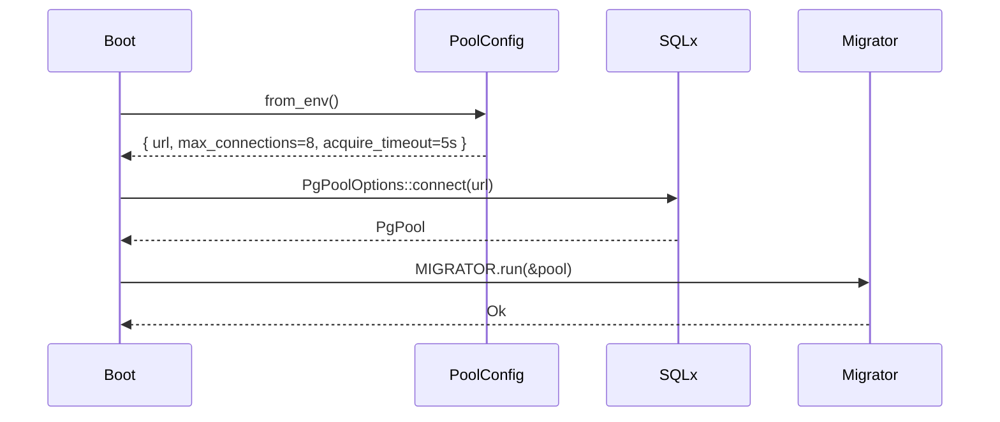
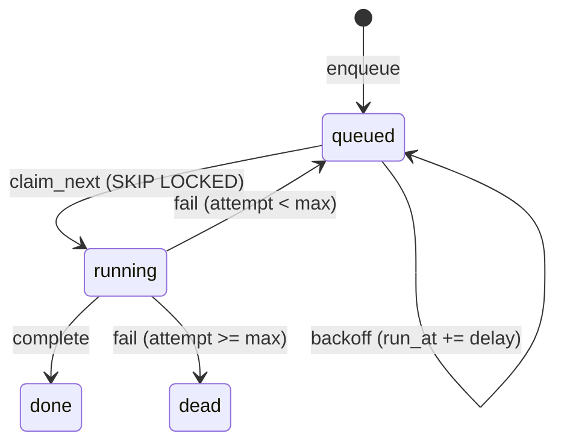
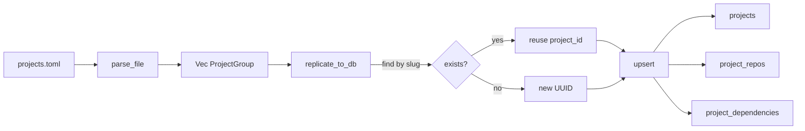

# Persistence (Postgres)

> **Status:** ACTIVE · **Crate:** [`persistence/`](../../persistence) ·
> **Schema reference:** [reference/database-schema](../reference/database-schema.md)

Postgres 16 is the system of record. Everything that needs durable
state — projects, the job queue, MR reviews, the code graph, idempotency
log — lives here. Qdrant holds vectors only. This page explains **how**
the crate operates; the schema itself is in
[database-schema](../reference/database-schema.md).

## Who touches what

```mermaid
flowchart LR
    API[api crate] --> projects
    API --> jobs
    API --> webhook_events
    API --> mr_reviews
    Worker[worker crate] --> jobs
    Worker --> mr_reviews
    Worker --> index_state
    Worker --> graph_persist
    graph_persist --> graph_nodes
    graph_persist --> graph_edges
    Retrieve[/retrieve handler] --> graph_nodes
    Retrieve --> graph_edges
    Boot[boot path] --> projects
    Boot --> project_repos
    Boot --> project_dependencies
```

| Table | Written by | Read by |
| --- | --- | --- |
| `projects` / `project_repos` / `project_dependencies` | boot (`projects_config::load_and_replicate`) | api (admin routes), worker, retrieve |
| `webhook_events` | api (`/webhooks/*`) | api (idempotency dedup) |
| `jobs` | api (webhooks, `/admin/reindex_*`), worker (auto-split fan-out, retries) | worker (`claim_next`) |
| `mr_reviews` | worker (`IngestMrHandler`) | api (status) |
| `index_state` | worker (`ReindexHandler` — `mark_indexed` / `mark_checkpoint`) | worker (resume) |
| `secrets_metadata` | rotation tooling (out of band) | audit only — no plaintext stored |
| `graph_nodes` / `graph_edges` | worker (`graph_persist::persist_graph`) | retrieve (`expand_k_hops`, `find_nodes_by_fqns`) |

## Pool lifecycle

`PgPoolOptions` is the only constructor; everything else is cloned
`PgPool` (cheap `Arc<>`). Boot is optional — when `DATABASE_URL` is
unset and `DATABASE_OPTIONAL=true`, the binary still starts.



Knobs (env, defaults in code):

| Var | Default | Purpose |
| --- | --- | --- |
| `DATABASE_URL` | unset | sqlx-style postgres URL. |
| `DATABASE_MAX_CONNECTIONS` | `8` | Pool cap; each worker + admin route concurrently competes for these. |
| `DATABASE_OPTIONAL` | `true` | Boot succeeds without a pool. Flip to `false` in prod. |

Log lines emitted by `persistence::init_pool` / `run_migrations`
(target = `persistence`):

```text
INFO persistence: postgres pool ready max_conn=8
INFO persistence: migrations applied
WARN persistence: DATABASE_URL not set; running without persistence
```

## Migrations

Embedded at compile time via `sqlx::migrate!("./migrations")`. Files
live in [`persistence/migrations/`](../../persistence/migrations).
Naming: `<YYYYMMDD>_<NNNN>_<short_name>.<up|down>.sql`.

Rules (enforced by review, not the toolchain):

1. One logical change per migration. **Never edit a merged migration.**
2. Every `*.up.sql` ships a matching `*.down.sql`. Down migrations are
   dev-only — production never runs them.
3. Use `IF NOT EXISTS` / `IF EXISTS` so reapplied migrations are no-ops.

The S-counter that prefixed early migrations is gone; new migrations
just take the next available number. See
[database-schema → Migration workflow](../reference/database-schema.md#migration-workflow)
for the `just db-*` commands.

## Transaction patterns

The crate exposes two flavours of helpers:

| Helper | Use when |
| --- | --- |
| `*::operation(pool, ...)` | Self-contained — opens its own short transaction. |
| `*::operation_in_tx(tx, ...)` | Caller owns the transaction; needed when several writes must be atomic. |

Two atomic windows in the codebase today:

1. **Webhook ingest** — `webhook_events::record_in_tx` →
   `jobs::enqueue_in_tx` → `tx.commit()`. Without the transaction, a
   crash between dedup-write and job-insert would silently lose the
   webhook.
2. **Auto-split fan-out** — `ReindexHandler` opens `pool.begin()`,
   loops `jobs::enqueue_in_tx` per top-level dir, commits. Mid-loop
   failure rolls every sibling back so the parent retries cleanly
   without leaving orphan sub-jobs.

## Job queue (SKIP LOCKED)

The queue is one table, claimed via `FOR UPDATE SKIP LOCKED` so any
number of workers can compete without coordinator state.



The claim is one round-trip with a CTE:

```sql
WITH next AS (
    SELECT id FROM jobs
     WHERE status='queued' AND run_at <= now()
     ORDER BY run_at
     FOR UPDATE SKIP LOCKED
     LIMIT 1
)
UPDATE jobs j
   SET status='running', locked_at=now(), locked_by=$1, attempt=attempt+1
  FROM next
 WHERE j.id = next.id
RETURNING j.*;
```

Failure path bumps `run_at` with an exponential backoff
(`initial × 2^(attempt-1)`, capped at `max_backoff`, default 300s).
When `attempt >= max_attempts` the job moves to `dead` — no automatic
revival. Inspect with:

```sql
SELECT id, kind, attempt, last_error
  FROM jobs WHERE status='dead' ORDER BY finished_at DESC LIMIT 20;
```

Worker log lines you'll see in practice (target = `worker`):

```text
INFO  worker: claimed job kind=Reindex id=...
WARN  worker: handler failed retry_in_ms=5000 attempt=2
ERROR worker: job moved to dead kind=Reindex attempts=5
```

Full kind list and producers: [reference/job-queue](../reference/job-queue.md).

## Graph persistence

`graph_persist::persist_graph(pool, repo_id, nodes, edges)` is the
single entry point from the worker's `Reindex` handler. The flow:

```mermaid
sequenceDiagram
    participant Worker
    participant graph_persist
    participant graph_nodes
    participant graph_edges

    Worker->>graph_persist: persist_graph(repo_id, nodes, edges)
    graph_persist->>graph_nodes: upsert (repo_id, fqn) ON CONFLICT DO UPDATE
    graph_nodes-->>graph_persist: node_ids
    note over graph_persist: resolve edge endpoints by fqn;<br/>create placeholder nodes for<br/>unresolved targets (imports, calls)
    graph_persist->>graph_nodes: upsert placeholders
    graph_persist->>graph_edges: upsert (from, to, type) ON CONFLICT DO UPDATE
    graph_persist-->>Worker: PersistResult { nodes_upserted, edges_upserted, placeholders_created }
```

A `Custom("placeholder")` node is real, on purpose — when an edge
points at a symbol we haven't seen yet (e.g. `Imports` to a
third-party crate, `Calls` to a symbol discovered only as a string),
the placeholder keeps the graph referentially consistent. The next
indexing run upgrades it to a concrete node via the
`(repo_id, fqn)` unique key.

Returned counters are logged at `info!`:

```text
INFO worker.handler: Reindex: graph persisted persist=PersistResult { nodes_upserted: 312, edges_upserted: 740, placeholders_created: 12 }
```

## Project config replication

`projects.toml` is the source of truth for repo identity. Boot calls
`projects_config::load_and_replicate`:



Idempotent: the same file applied twice produces the same rows. Repo
IDs are matched by `(project_id, remote_url)`; removed remotes cascade
into `project_dependencies`.

Log line:

```text
INFO persistence: project group synced slug=flutter-monorepo repos=4
```

## Audit log (sprint 3)

`audit_log` (migration `20260512_0012`) records every request that hits
the admin router. One row per call:

| Column | Type | Notes |
|---|---|---|
| `id` | BIGSERIAL | PK |
| `request_id` | TEXT | `X-Request-Id` from the client, `-` when absent |
| `route` | TEXT | URI path, e.g. `/admin/reindex_repo` |
| `method` | TEXT | `POST` / `GET` |
| `status` | SMALLINT | HTTP response code |
| `latency_ms` | INTEGER | wall-clock between request enter and response |
| `payload_size` | INTEGER | request body length in bytes (NULL if body capture failed) |
| `payload_sha256` | CHAR(64) | sha256 of the request body — bodies themselves are **never** stored |
| `token_hash` | CHAR(16) | first 16 hex chars of `sha256(X-Admin-Token)`, NULL when unauth |
| `project_id` | UUID | NULL until 🅲 multi-tenant lands |
| `created_at` | TIMESTAMPTZ | row creation time |

Indexes: `created_at`, `request_id`, partial on `project_id` IS NOT NULL.

Writes go through [`persistence::repos::audit::insert`](../../persistence/src/repos/audit.rs).
The observability crate's middleware drops to `tokio::spawn` so the
response is never blocked. Failures surface only in the `audit` log
target.

Retention is enforced by a background task in `api::start` calling
[`delete_expired`](../../persistence/src/repos/audit.rs); see
[operations](../operations.md#audit-retention).

## Observability cheatsheet

Every persistence-side log is emitted with `target = "persistence"`
(and `target = "worker.handler"` for the worker glue). Useful filters:

```bash
# Live tail just persistence layer
RUST_LOG="persistence=debug,sqlx=warn" cargo run

# Find dead jobs
psql $DATABASE_URL -c "SELECT kind, count(*) FROM jobs WHERE status='dead' GROUP BY kind;"

# Watch in-flight reviews
psql $DATABASE_URL -c "SELECT mr_iid, status, started_at FROM mr_reviews WHERE status IN ('pending','running') ORDER BY started_at DESC;"

# Stuck workers (locked > 5 minutes)
psql $DATABASE_URL -c "SELECT id, kind, locked_by, locked_at FROM jobs WHERE status='running' AND locked_at < now() - interval '5 minutes';"
```

## Failure modes

| Scenario | Surfaced as | Recovery |
| --- | --- | --- |
| Pool exhausted | `acquire_timeout` (5s) hit → `PersistenceError::Sqlx` | Bump `DATABASE_MAX_CONNECTIONS`; check for long-running queries. |
| Migration drift | `MIGRATOR.run` returns `MigrateError` | CI catches via `db-prepare`; never edit landed migrations. |
| Webhook double-delivery | `webhook_events` unique `(provider, event_id)` rejects | Returns `200 OK` with `duplicate=true`; no job enqueued. |
| Worker crash mid-job | Row left in `running` with stale `locked_by` | A timeout sweeper picks it up at the next backoff window (`run_at` was set when claimed). |
| Reindex timeout | `mark_checkpoint(path_prefix)` then job re-queued | S9 timeout path; see [ingestion-pipeline](ingestion-pipeline.md). |
| Auto-split mid-fan-out failure | Transaction rollback → no orphan sub-jobs | Parent retries via standard backoff. |

## Related docs

- [Database schema](../reference/database-schema.md) — every table, every column.
- [Job queue](../reference/job-queue.md) — kinds, payloads, retry policy.
- [Ingestion pipeline](ingestion-pipeline.md) — how `ReindexHandler` orchestrates writes.
- [Operations](../operations.md) — pre-flight + troubleshooting.
