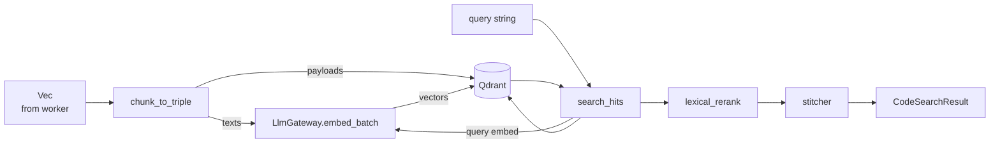

# rag-base — Vector Search & Indexing

> **Status:** STABLE · **Crate:** [`rag-base/`](../../rag-base/) ·
> **Layer:** L2 — Capabilities

Reads the JSONL produced by `code-indexer`, embeds each chunk via the LLM
Gateway, and upserts vectors into Qdrant. Provides semantic search +
lexical re-ranking for the orchestration layer.

## Purpose

- **Index** a project's code chunks into Qdrant for fast semantic recall.
- **Search** for code semantically similar to a given query, with lexical
  re-ranking that boosts exact substring / quoted-string matches (important
  for code-shaped queries).
- **Stitch** raw hits into contiguous code blocks suitable for prompts.

## Public API

| Item | File | Purpose |
| --- | --- | --- |
| `load_fresh_index(gateway, project_name)` | [`src/lib.rs:36`](../../rag-base/src/lib.rs#L36) | Drop and rebuild a Qdrant collection from JSONL. |
| `search_code(gateway, project_name, query, k)` | [`src/lib.rs:121`](../../rag-base/src/lib.rs#L121) | Semantic + lexical search returning stitched code blocks. |
| `vector_db::delete_by_filter(client, cfg, filter)` | [`src/vector_db.rs`](../../rag-base/src/vector_db.rs) | Generic delete by `Filter` (S1). |
| `vector_db::delete_by_repo(client, cfg, repo_id)` | [`src/vector_db.rs`](../../rag-base/src/vector_db.rs) | Wipe all chunks for a repo (S1). |
| `vector_db::delete_by_file(client, cfg, repo_id, file)` | [`src/vector_db.rs`](../../rag-base/src/vector_db.rs) | Wipe all chunks for a single file in a repo (S1). |
| `vector_db::scroll_repo_chunk_metas(client, cfg, repo_id, page_size)` | [`src/vector_db.rs`](../../rag-base/src/vector_db.rs) | Stream `(id, content_sha256, file)` for incremental dedup (S1, wired in S2). |
| `CodeSearchResult` | [`src/structs/search_result.rs`](../../rag-base/src/structs/) | Output type. |
| `IndexStats` | [`src/structs/rag_store.rs`](../../rag-base/src/structs/) | Indexing summary. |
| `VectorPayload` | [`src/structs/rag_store.rs`](../../rag-base/src/structs/rag_store.rs) | Qdrant payload — see [Qdrant Schema](../reference/qdrant-schema.md). |
| `RagBaseError` | [`src/errors/rag_base_error.rs`](../../rag-base/src/errors/rag_base_error.rs) | Crate error. |
| `RagConfig` | [`src/structs/rag_base_config.rs`](../../rag-base/src/structs/rag_base_config.rs) | Index/search settings (loaded from env). |

The mutation helpers are the **only** sanctioned way to evolve a live
collection; `load_fresh_index` remains for full rebuilds and bootstrap.
S2 wires the worker through them to drive incremental content-sha
deduplication without re-embedding unchanged chunks.

## Architecture



`rag-base` is the **only** consumer of the embedding tier in production
flows. The worker `Reindex` handler writes vectors through
`upsert_repo_chunks`; the legacy `/search_vector_base` route still
reaches Qdrant through `search_code` here (replaced by `/retrieve` in S8).

## Configuration

Loaded from env via `RagConfig::from_env(Some(project_name))`:

| Var | Purpose | Default |
| --- | --- | --- |
| `QDRANT_URL` | gRPC URL of Qdrant. | `http://localhost:6334` |
| `QDRANT_COLLECTION` | Target collection name. | `mr_ai_code` |
| `QDRANT_DISTANCE` | `Cosine` / `Dot` / `Euclid`. | `Cosine` |
| `QDRANT_BATCH_SIZE` | Upsert batch size. | `256` |
| `EMBEDDING_DIM` | Expected vector dimension (validated against gateway output). | `1024` |
| `RAG_DISABLE` | Short-circuit search to empty. | `false` |
| `RAG_TOP_K` | Default `k` for search. | `20` |
| `RAG_MIN_SCORE` | Minimum vector score. | `0.0` |
| `CLAMP_PREVIEW_MAX_CHARS` / `_LINES` | Snippet preview budget. | `320` / `50` |
| `CLAMP_EMBED_MAX_CHARS` / `_LINES` | Embedding text budget. | `1200` / `80` |
| `CHUNK_MIN_CHARS` | Skip chunks shorter than this. | `16` |
| `INDEX_JSONL_PATH` | Legacy JSONL hydration path used by `search_code`'s stitcher; populated by the deprecated `/search_vector_base` flow and unused by the worker `Reindex` pipeline. | `code_data/out/<project>/code_chunks.jsonl` |

The embedding **model** and **endpoint** are intentionally **not** read by
this crate any more — they live on the gateway. `EMBEDDING_DIM` is kept here
as a sanity check on the vectors returned.

## Usage example

```rust
use std::sync::Arc;
use ai_llm_service::LlmGateway;
use rag_base::{search_code, upsert_repo_chunks};

async fn reindex_and_query(
    client: &qdrant_client::Qdrant,
    cfg: &rag_base::structs::rag_base_config::RagConfig,
    gateway: Arc<LlmGateway>,
    repo_id: &str,
    project_id: Option<&str>,
    chunks: &[code_indexer::CodeChunk],
) -> Result<(), Box<dyn std::error::Error>> {
    let report = upsert_repo_chunks(client, cfg, &gateway, repo_id, project_id, chunks).await?;
    println!("upserted {} / kept {} / deleted {}", report.upserted, report.kept, report.deleted);

    let hits = search_code(gateway, "demo", "user repository pattern", Some(10)).await?;
    for h in hits {
        println!("{} :: score={:.3}", h.file, h.score);
    }
    Ok(())
}
```

## Internal structure

```
rag-base/src/
├── lib.rs              # search_code (legacy) + re-exports for ingest helpers
├── ingest.rs           # upsert_repo_chunks (S2 content-sha dedup)
├── embedding.rs        # build_embedding_text, clamp_snippet_ex, embed_texts
├── jsonl_reader.rs     # chunk_to_triple + ChunkScope (in-memory, no JSONL)
├── search.rs           # search_hits + lexical_rerank + scroll fallback
├── stitcher.rs         # merges overlapping hits into code blocks
├── vector_db.rs        # Qdrant client glue
├── errors/             # RagBaseError (wraps GatewayError)
└── structs/            # config, rag_store, search_result types
```

### Search ranking

1. **Vector top-k** via Qdrant.
2. **Lexical re-ranking** — IDF-weighted token matches, quoted substring
   bonuses, key:"value" proximity, language-hint match.
3. **Fallback scroll** — for short / code-shaped queries, additionally pull
   matches by `search_terms` payload filter and merge.
4. **Stitching** — `search_hits_to_code_results` merges overlapping spans
   per file into contiguous blocks with full source.

## Errors

| Variant | When |
| --- | --- |
| `EnvMissing { key }`, `EnvParse { key, value }` | Bad / missing config. |
| `InvalidConfig(String)` | Logical config error (zero `EMBEDDING_DIM`, etc.). |
| `Io(_)` | JSONL read failure. |
| `Json(_)` | JSONL parse failure. |
| `Qdrant(String)` | Vector DB transport / RPC error. |
| `Embedding(String)` | Mismatched dimensions, empty embeddings response. |
| `Gateway(GatewayError)` | Forwarded from `ai-llm-service`. |

## Testing

Unit tests cover `VectorPayload` round-trips (legacy + new fields).
`tests/integration.rs` exercises Qdrant via testcontainers: the
S1 delete/scroll helpers and the S2 content-sha dedup pipeline
(`upsert_repo_chunks_dedup_pipeline`). Marked `#[ignore]`; run with
`cargo test --workspace --tests -- --ignored`.

## Related docs

- [Data Flow — Master push reindex](../architecture/data-flow.md#flow-1--master-push-reindex-s2)
- [Qdrant Schema](../reference/qdrant-schema.md)
- [services/ingestion-pipeline](ingestion-pipeline.md)
- [services/ai-llm-service](ai-llm-service.md)
- [services/code-indexer](code-indexer.md)
- [Configuration](../guides/configuration.md)
