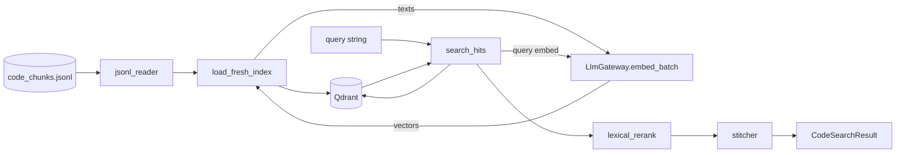

# rag-base — Vector Search & Indexing

> **Status:** STABLE · **Crate:** [`rag-base/`](../../rag-base/) ·
> **Layer:** L2 — Capabilities

Reads the JSONL produced by `code-indexer`, embeds each chunk via the LLM
Gateway, and upserts vectors into Qdrant. Provides semantic search +
lexical re-ranking for the orchestration layer.

## Purpose

- **Index** a project's code chunks into Qdrant for fast semantic recall.
- **Search** for code semantically similar to a given query, with lexical
  re-ranking that boosts exact substring / quoted-string matches (important
  for code-shaped queries).
- **Stitch** raw hits into contiguous code blocks suitable for prompts.

## Public API

| Item | File | Purpose |
| --- | --- | --- |
| `load_fresh_index(gateway, project_name)` | [`src/lib.rs:36`](../../rag-base/src/lib.rs#L36) | Drop and rebuild a Qdrant collection from JSONL. |
| `search_code(gateway, project_name, query, k)` | [`src/lib.rs:121`](../../rag-base/src/lib.rs#L121) | Semantic + lexical search returning stitched code blocks. |
| `CodeSearchResult` | [`src/structs/search_result.rs`](../../rag-base/src/structs/) | Output type. |
| `IndexStats` | [`src/structs/rag_store.rs`](../../rag-base/src/structs/) | Indexing summary. |
| `RagBaseError` | [`src/errors/rag_base_error.rs`](../../rag-base/src/errors/rag_base_error.rs) | Crate error. |
| `RagConfig` | [`src/structs/rag_base_config.rs`](../../rag-base/src/structs/rag_base_config.rs) | Index/search settings (loaded from env). |

## Architecture



`rag-base` is the **only** consumer of the embedding tier in production
flows. Both `git-context-engine` (search) and `api` (`/vector_base_index`,
`/search_vector_base`) reach Qdrant exclusively through this crate.

## Configuration

Loaded from env via `RagConfig::from_env(Some(project_name))`:

| Var | Purpose | Default |
| --- | --- | --- |
| `QDRANT_URL` | gRPC URL of Qdrant. | `http://localhost:6334` |
| `QDRANT_COLLECTION` | Target collection name. | `mr_ai_code` |
| `QDRANT_DISTANCE` | `Cosine` / `Dot` / `Euclid`. | `Cosine` |
| `QDRANT_BATCH_SIZE` | Upsert batch size. | `256` |
| `EMBEDDING_DIM` | Expected vector dimension (validated against gateway output). | `1024` |
| `RAG_DISABLE` | Short-circuit search to empty. | `false` |
| `RAG_TOP_K` | Default `k` for search. | `20` |
| `RAG_MIN_SCORE` | Minimum vector score. | `0.0` |
| `CLAMP_PREVIEW_MAX_CHARS` / `_LINES` | Snippet preview budget. | `320` / `50` |
| `CLAMP_EMBED_MAX_CHARS` / `_LINES` | Embedding text budget. | `1200` / `80` |
| `CHUNK_MIN_CHARS` | Skip chunks shorter than this. | `16` |
| `INDEX_JSONL_PATH` | Override input JSONL path. | `code_data/out/<project>/code_chunks.jsonl` |

The embedding **model** and **endpoint** are intentionally **not** read by
this crate any more — they live on the gateway. `EMBEDDING_DIM` is kept here
as a sanity check on the vectors returned.

## Usage example

```rust
use std::sync::Arc;
use ai_llm_service::LlmGateway;
use rag_base::{load_fresh_index, search_code};

async fn rebuild_and_query(
    gateway: Arc<LlmGateway>,
    project_name: &str,
) -> Result<(), Box<dyn std::error::Error>> {
    let stats = load_fresh_index(gateway.clone(), project_name).await?;
    println!("indexed {} chunks in {} ms", stats.indexed, stats.duration_ms);

    let hits = search_code(gateway, project_name, "user repository pattern", Some(10)).await?;
    for h in hits {
        println!("{} :: score={:.3}", h.file, h.score);
    }
    Ok(())
}
```

## Internal structure

```
rag-base/src/
├── lib.rs              # load_fresh_index, search_code
├── embedding.rs        # build_embedding_text, clamp_snippet_ex, embed_texts (delegates to gateway)
├── jsonl_reader.rs     # streaming JSONL reader → batches
├── search.rs           # search_hits + lexical_rerank + scroll fallback
├── stitcher.rs         # merges overlapping hits into code blocks
├── vector_db.rs        # Qdrant client glue
├── errors/             # RagBaseError (now wraps GatewayError)
└── structs/            # config, rag_store, search_result types
```

### Search ranking

1. **Vector top-k** via Qdrant.
2. **Lexical re-ranking** — IDF-weighted token matches, quoted substring
   bonuses, key:"value" proximity, language-hint match.
3. **Fallback scroll** — for short / code-shaped queries, additionally pull
   matches by `search_terms` payload filter and merge.
4. **Stitching** — `search_hits_to_code_results` merges overlapping spans
   per file into contiguous blocks with full source.

## Errors

| Variant | When |
| --- | --- |
| `EnvMissing { key }`, `EnvParse { key, value }` | Bad / missing config. |
| `InvalidConfig(String)` | Logical config error (zero `EMBEDDING_DIM`, etc.). |
| `Io(_)` | JSONL read failure. |
| `Json(_)` | JSONL parse failure. |
| `Qdrant(String)` | Vector DB transport / RPC error. |
| `Embedding(String)` | Mismatched dimensions, empty embeddings response. |
| `Gateway(GatewayError)` | Forwarded from `ai-llm-service`. |

## Testing

No unit tests today; exercised end-to-end via the `/vector_base_index` and
`/search_vector_base` routes against a local Qdrant + Ollama stack.

## Related docs

- [Data Flow — Index a project](../architecture/data-flow.md#flow-1--index-a-project)
- [services/ai-llm-service](ai-llm-service.md)
- [services/code-indexer](code-indexer.md)
- [Configuration](../guides/configuration.md)
