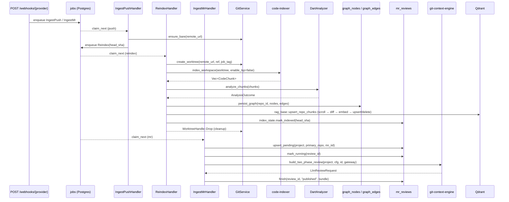

# Review Pipeline

`BETA`

S6 wires the worker handlers end-to-end. Inbound webhooks (S2) land in the
queue, `IngestPush` refreshes the bare clone and chains `Reindex`,
`IngestMr` resolves the provider and snapshots the two-phase review bundle
into `mr_reviews.bundle`. The actual LLM call + comment posting is
deferred to S7.

## Sequence

## ReindexHandler

[`worker::handlers::ReindexHandler`](../../worker/src/handlers.rs)

| Step | Module | Notes |
| --- | --- | --- |
| Resolve repo | `persistence::repos::projects::find_repo_by_remote_url_lenient` | Tolerates `.git` suffix mismatches between webhook payloads and `projects.toml` declarations. |
| Create worktree | `project_code_store::GitService::create_worktree` | Refspec preference: `head_sha` → `branch` → `FETCH_HEAD`. |
| Index workspace | `code_indexer::index_workspace` | Public S6 helper; runs inside `tokio::task::spawn_blocking`. Re-roots `chunk.file` to repo-relative paths so graph IDs stay stable across worktrees. |
| Analyze | `code_indexer::analyzer::DartAnalyzer::analyze_chunks` | Pure data → `(NodeIntent, EdgeIntent, Coverage)`. |
| Persist | `persistence::graph_persist::persist_graph` | Resolves fqns to `NodeId`s, materialises placeholders for unknown endpoints. |
| Embed + upsert (S2) | `rag_base::upsert_repo_chunks` | Diffs `content_sha256` against Qdrant via `scroll_repo_chunk_metas`; keeps unchanged chunks, embeds only the upsert set, deletes orphans by stable id. See [Ingestion Pipeline](ingestion-pipeline.md). |
| Mark indexed | `persistence::repos::index_state::mark_indexed` | Only when `head_sha` is supplied. Also clears `last_indexed_path_prefix` (S9 resume checkpoint). |
| Cleanup | `WorktreeHandle::Drop` | `git worktree prune` runs even on early exit. |

LSP enrichment is gated off (`enable_lsp = false`) for now — the worker
runs in containers without `dart` on `$PATH`. Re-enabling it lands with
the Dart Analyzer sidecar in S8.

## IngestMrHandler

[`worker::handlers::IngestMrHandler`](../../worker/src/handlers.rs)

The handler:

1. Parses the webhook-shaped payload (`provider`, `remote_url`, `mr_iid`,
   optional `source_branch` / `target_branch` / `head_sha`).
2. Resolves the repo to `(project_id, repo_id)` and opens a row in
   `mr_reviews` (`pending` → `running`).
3. Builds a `ProviderConfig` using the legacy `GIT_API_BASE` plus the
   `git_token` resolved through `SecretProvider` (project-aware routing
   lands in S7 alongside per-project token mappings).
4. Calls
   [`git_context_engine::build_two_phase_review`](../../git-context-engine/src/lib.rs)
   — the same code path that `/trigger_git_mr` already uses.
5. Snapshots the resulting `LlmReviewRequest` into `mr_reviews.bundle` and
   sets the row to `published`. Failures land as `failed` with the error
   text in `bundle.error`.

After the bundle lands, two optional stages run depending on env flags:

### Optional rerank (`RAG_LLM_RERANK_ENABLED`)

When true, the handler calls
[`rerank_review_request`](../../git-context-engine/src/retrieval/review_rerank.rs)
which lifts every `LlmReviewTarget` into a `RetrievalSeed` (priority of
the planned anchor → seed score), runs `llm_rerank` against `ModelTier::Smart`
under `RAG_RERANK_TIMEOUT_SECS`, and folds the result back into a list of
`ScoredHit`s keyed by `<file_path>#<hunk_index>`. The output is recorded
in `mr_reviews.bundle.rerank` for diagnostics; failures degrade to the
heuristic ordering.

### Optional publishing (`REVIEW_PUBLISH_COMMENTS`)

When true, the handler builds an `ai_review_engine::publish::ProviderConfig`
from `GIT_API_BASE` + `GIT_TOKEN`, maps `domain::ProviderKind` to
`ai_review_engine::publish::GitProviderKind` (Gitlab / Github only;
Bitbucket Cloud has no inline-comment publisher in the engine and is
recorded as `skipped`), and calls
[`review_merge_request`](../../ai-review-engine/src/lib.rs). That function
runs the per-target LLM completion, parses each JSON response into an
`AiFileReview`, maps anchors to line-level draft comments, and posts them
via `MrCommentPublisher`. The publish status (`published` / `skipped` /
`failed`) lands in `mr_reviews.bundle.publish`.

Both stages are off by default so dev environments never publish by
accident. Set both flags to `true` (or `1`/`yes`) to enable end-to-end
review with LLM rerank diagnostics.

## Configuration

| Var | Default | Purpose |
| --- | --- | --- |
| `GIT_API_BASE` | (required) | Provider base URL passed into both `git-context-engine` and `ai-review-engine` config. |
| `GIT_TOKEN` | (required) | Provider auth token. Resolved via `SecretProvider`. |
| `PROJECTS_CONFIG` | `projects.toml` | Single `[[project]]` declaration sourced at boot; its slug is forwarded into the prompt assembly path. |
| `RAG_LLM_RERANK_ENABLED` | `false` | When `true`, run the LLM rerank diagnostic step after the bundle is built. |
| `RAG_RERANK_TIMEOUT_SECS` | `20` | Hard timeout for the rerank LLM call. |
| `REVIEW_PUBLISH_COMMENTS` | `false` | When `true`, run `review_merge_request` and post inline comments. |

## Failure modes

| Scenario | Behaviour |
| --- | --- |
| `remote_url` not in `projects.toml` | `Reindex` and `IngestMr` reject with `BadPayload` and the queue moves the job to `dead` after `max_attempts`. |
| `GIT_TOKEN` unset | `IngestMr` fails fast with `BadPayload`; `mr_reviews` row stays in `pending` (tweakable in S7 to `failed`). |
| Worktree creation fails | `Reindex` logs, exits, queue retries with backoff. |
| `build_two_phase_review` errors | `mr_reviews` row marked `failed`; queue retries up to `max_attempts`. |

## Related docs

- [Job queue](../reference/job-queue.md)
- [Git service](git-service.md)
- [Graph RAG (part 1)](graph-rag.md)
- [Graph RAG (part 2)](graph-rag-retrieval.md)
- [Database schema](../reference/database-schema.md)
